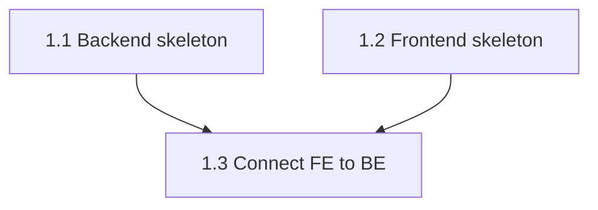

# IMPLEMENTATION PLAN FORMAT - MANDATORY

## ⚠️ CRITICAL: Each story is written as an individual file — follow exactly

---

## 🔢 SEQUENTIAL NUMBERING - NEVER RESET

**Rule**: Epic/story numbers MUST continue sequentially across entire project.

- ✅ Greenfield initial: Epic 1, Story 1.1
- ✅ Adding features: Continue from last (Epic 3.5 → 3.6 or Epic 4.1)
- ✅ Brownfield: ALWAYS continue from last
- ❌ NEVER reset to Epic 1, Story 1.1 (except first plan)

**Determine Starting Numbers**:

1. Run: `aire next-number` (scans existing plans)
2. Manual: Check `docs/plans/implementation-plan.md` + `docs/plans/stories/` for highest numbers
3. Ask user: "Found Epic X, Story X.Y. Start from Epic [N], Story [N.M]? (yes/no)"

**Why**: Maintains history, prevents conflicts, avoids overwrites

---

## 🔀 VERTICAL FEATURE SLICES (MANDATORY)

**Rule**: Order by FEATURE, not LAYER

- ✅ Epic 1: Foundation (FE+BE scaffolding, connection test)
- ✅ Epic 2+: One feature end-to-end (BE API → FE UI → Integration)
- ✅ Testable after each epic

**❌ WRONG (Horizontal)**:
```
Epic 1: All Backend (webhook, LLM, DB)
Epic 2: All Frontend (dashboard, components)
Epic 3: Integration
Problem: Nothing works until Epic 3
```

**✅ CORRECT (Vertical)**:
```
Epic 1: Foundation
  1.1: BE Skeleton (Express, health)
  1.2: FE Skeleton (React, routing)
  1.3: Connect (health check displayed)
  ✅ TESTABLE: "Backend Connected" on homepage

Epic 2: Webhook Pipeline (Complete Feature)
  2.1: Webhook Receiver (BE)
  2.2: LLM Analyzer (BE)
  2.3: Comment Poster (BE)
  2.4: Dashboard UI (FE)
  2.5: Integration Test
  ✅ TESTABLE: PR → analysis → comment → dashboard
```

**Story Order Within Epic**: Backend → Frontend → Integration

**Why**: Testable after each epic, early feedback, low risk, clear progress

---

## 📊 STORY-DEPENDENCY GRAPH (MANDATORY when plan has 2+ stories)

**Rule**: Whenever an implementation plan contains 2 or more stories, the plan workflow MUST also produce a machine-readable dependency graph at `docs/plans/dependency-graph.yml`. The graph drives parallel execution in `aire-dev-implement`, `aire-dev-remediate`, `aire-review-code`, `aire-qa-validate`, and `aire-qa-triage`.

### Artifact: `docs/plans/dependency-graph.yml`

```yaml
version: 1
generated_by: AIRE_ARCHITECT
generated_at: [YYYY-MM-DD]

team_size: 3
# Number of developers working on this project. Asked once during the plan
# workflow. Used as a planning hint for how finely to split stories and to
# size waves. Not a runtime concurrency cap — parallel modes dispatch as
# many subagents as the ready queue allows.

shared_files: []
# Files that serialize across concurrent stories (e.g. package.json, route
# registry, migrations index). Empty by default. Architect populates.

stories:
  - id: 1.1
    title: Backend skeleton
    epic: 1
    cycle: CYCLE-1            # Omit if no build cycles
    jira: PROJ-101            # If Jira-sourced; else LOCAL
    assignee: alice@org.com   # If known (Jira import) or assigned by user; else null
    requires: []
    enables: [1.3]
    files_touched:
      - src/server/index.ts
      - src/server/health.ts
  - id: 1.2
    title: Frontend skeleton
    epic: 1
    requires: []
    enables: [1.3]
    files_touched:
      - src/web/main.tsx
      - src/web/App.tsx
  - id: 1.3
    title: Connect FE to BE
    epic: 1
    requires: [1.1, 1.2]
    enables: []
    files_touched:
      - src/web/health-check.tsx

waves:
  - wave: 1
    stories: [1.1, 1.2]
  - wave: 2
    stories: [1.3]

assignments:
  alice@org.com:
    role_hint: backend         # Optional free-text — used in CLI output only
    queue: [1.1, 1.3]
  bob@org.com:
    role_hint: frontend
    queue: [1.2]
# `assignments:` is REQUIRED when team_size >= 2.
# Each developer's `queue:` is the dependency-aware ordering of stories
# assigned to them (assignee field on each story must match a key here).
# `aire next-parallel --assignee <name>` reads this block to print a
# per-dev queue. `aire-dev-implement` mode 1 uses it for "filter by my
# assignee" prompts.
```

### Assignments Rule

- When `team_size >= 2`, the graph MUST include an `assignments:` block mapping each developer to their dependency-aware story queue. Each story's `assignee` MUST match a key in `assignments:`.
- For `team_size = 1`, `assignments:` is optional (one implicit queue).
- The queue order respects `requires`: if story B requires A and both are assigned to the same dev, A appears first in their queue.
- When `assignee` is split across stories that one dev wouldn't naturally own (e.g. a backend dev assigned a frontend-only story), the plan workflow flags it during Phase 1.5 for user confirmation.

### Wave Derivation Rule

- **Wave 1** = all stories with `requires: []`.
- **Wave N+1** = all stories whose `requires` are entirely satisfied by waves ≤ N.
- The `waves:` block is regenerated whenever the graph changes.

### Disjoint-Files Contract

- Any two stories in the same wave MUST have disjoint `files_touched`, **modulo `shared_files`**.
- `shared_files` (e.g. `package.json`, a central route registry, a migrations index) are the only files allowed to appear in multiple stories' `files_touched`. Subagents NEVER write to `shared_files` during parallel execution — the parent agent serializes those edits.
- If two independent stories overlap on a non-shared file, the architect SPLITS the stories before writing the graph.

### Per-Story Header — Required Fields

Every story file's header MUST mirror the graph entry by adding these lines after `**Jira**`:

```
**Requires**: [1.1, 1.2]       # Stories that must be Done before this one starts
**Enables**: [2.1]              # Stories this one unblocks (informational)
**Files Touched**:              # Files the implementing subagent is allowed to edit
  - src/web/health-check.tsx
  - src/web/App.tsx
**Assignee**: alice@org.com     # Optional — copied from Jira import; null/omit if unassigned
```

### Mermaid Mirror

The implementation plan adds a `## Dependency Graph` section at the top with a Mermaid `graph TD` rendering of the YAML plus a wave summary table. The Mermaid is for humans; if it drifts from the YAML, **the YAML wins**. Run `aire graph-check` to detect drift.

**Example Mermaid (mirrors the YAML above):**



| Wave | Stories | Can run in parallel? |
|------|---------|----------------------|
| 1 | 1.1, 1.2 | Yes — disjoint files |
| 2 | 1.3 | (single story) |

---

## Document Structure

```
# [Project] - Implementation Plan

**Project**: [Name] | **Version**: [X.X] | **Created**: [YYYY-MM-DD]
**Author**: [ARCHITECT/ANALYST_PM] | **Status**: [AWAITING/APPROVED/IN PROGRESS]

---

## 1. Overview

**Success Criteria**: [List all measurable criteria]

**Epic Breakdown**:
- Epic 1: [Name] - [Goal]
- Epic 2: [Name] - [Goal]

---

## EPIC [N]: [NAME IN CAPS]

**Owner**: [DEV/ARCHITECT] | **Goal**: [Epic goal]

**Must Read References** (if applicable):
- `SPEC/references/[file]` - [Description]
- `docs/ui-ux/ui-ux-spec.md` - [For FE stories]

**Prerequisites**: [List] | **Completion**: [Criteria]

---

### Story [N.M]: [Title]

**File**: `docs/plans/stories/epic-N-story-N.M-Story-Title.md` (always — no build prefix in filename)

**BUILDID**: CYCLE-[N] | **Epic**: [N] - [NAME] | **ID**: [N.M] | **Date**: [YYYY-MM-DD] | **Jira**: [JIRA-ID]
**Build Ref**: `SPEC/references/builds/[build-doc]` — [1-line summary of build scope]
**Requires**: [list of story IDs that must be Done first; `[]` if none]
**Enables**: [list of story IDs this unblocks; `[]` if none]
**Files Touched**:
  - [path/to/file1]
  - [path/to/file2]
**Assignee**: [email or name; omit if unassigned]
(Include BUILDID only when build cycles exist via `aire-build-cycles`. Include Jira field always: use actual Jira ID e.g. `PROJ-101` if story originated from Jira, or `LOCAL` if created locally. Omit Build Ref if no named builds. `Requires`, `Enables`, `Files Touched` MUST match `docs/plans/dependency-graph.yml`. `Assignee` mirrors the graph; omit when null.)
**Must Read**:
- `SPEC/references/[file]` - [Desc]
- `docs/ui-ux/ui-ux-spec.md` - [For FE]

**Description**:
[Detailed explanation of what this story does, what it achieves, and why it matters. Describe the feature or change being implemented, the problem it solves, and the expected outcome for the user or system. This should give a developer full understanding of the story's purpose before reading the implementation steps.]

**Design Tokens** (FE only):
- Colors: primary #1976D2, error #F44336
- Spacing: 16px fields, 8px padding
- Typography: 14px base, 600 labels
- Validation: real-time | Error: inline

**Acceptance Criteria** (comprehensive — list every testable criterion):
- [Criterion 1]
- [Criterion 2]
- [Criterion 3]
- [Criterion 4 — edge cases]
- [Criterion 5 — validation scenarios]
- [Criterion N — as many as needed to fully define "done"]

**Prerequisites**: [List]

**Context**: `path/file1.md`, `path/file2.md`

**Patterns**: [Name] - See `docs/architecture/design/01-patterns-and-standards-greenfield.md` (greenfield) or `docs/architecture/design/03-patterns-and-standards-brownfield.md` (brownfield) — plan workflow fills in the one that applies

**Steps**:

1. [Step]:
   ```lang
   [Code]
   ```

2. [Step]:
   ```lang
   [Code]
   ```

**Tests**:

```lang
describe('[Feature]', () => {
  it('[behavior]', () => {
    // Test
  });
});
```

Manual: [List test cases]

**Quality**: ESLint 0 errors, tests pass, coverage ≥85%, no console errors

**OUT**: ❌ [Not implementing]

**Evidence**: Test output, coverage report, screenshot

---

## Quality Gates

**Per Story**: Patterns followed, tests pass, ESLint 0, AC met, self-review
**Per Epic**: All stories done, tests pass, feature works, docs updated
**Final**: All epics done, coverage target, 0 errors, UAT passed

---

## Risks

| Risk | Impact | Mitigation |
|------|--------|------------|
| [Risk] | [H/M/L] | [Strategy] |

---

## CRITICAL RULES

**Every Story MUST Have**:
1. Must Read References (top - SPEC/references/, ui-ux-spec.md for FE)
2. Design Tokens if applicable (FE only - colors, spacing, typography, validation, errors)
3. Epic Context (BUILDID, epic number, name, ID, date, Jira ID)
4. Story Description (detailed explanation of what the story does, achieves, and why it matters)
5. Acceptance Criteria (comprehensive — cover every functional, edge-case, and validation scenario; as many as needed)
6. Prerequisites
7. Context Files (paths)
8. Patterns (with doc links)
9. Steps (detailed, numbered, code with tokens)
10. Tests (unit + manual)
11. Quality (linter, coverage)
12. OUT (what NOT to do)
13. Evidence (test output, screenshots)
14. **BUILDID**: Include `BUILDID` when build cycles exist (via `aire-build-cycles`)
15. **Jira**: Always include — `PROJ-101` if from Jira, `LOCAL` if created locally
16. **Requires / Enables / Files Touched**: Must mirror `docs/plans/dependency-graph.yml` exactly (when plan has 2+ stories)
17. **Assignee**: Include when known (copied from Jira import or assigned by user during planning); omit when null

**Epic Format**:
- Header ALL CAPS
- Owner, Goal
- Must Read References (if applicable)
- Prerequisites, Completion Criteria

**Reference Files**:
- TOP of epics/stories
- Full path: `SPEC/references/[file]`, `docs/ui-ux/ui-ux-spec.md` for FE
- Description for each
- DEV reads FIRST

**Design Tokens (FE)**:
- Extract from docs/ui-ux/ui-ux-spec.md
- Specify: colors, spacing, typography, validation, error display
- Use values in code: `color: '#1976D2'` not `color: 'primary'`
- Ensures beautiful UI by default

**Code Blocks**:
- Language identifier required
- Complete, executable
- Comments for non-obvious code

**Why**: Each story file is self-contained — DEV can implement it in a fresh AI session without loading the full plan

---

## Validation Checklist

- Numbering verified (ran `aire next-number` or manual check)
- Sequential numbering (NOT reset to 1.1)
- Reference files at top
- FE stories have design tokens
- Epics have owner
- Stories have epic context
- Story description detailed and present
- Acceptance Criteria comprehensive (covers all scenarios)
- Tests included
- OUT scope defined
- Code blocks have language
- Quality gates defined
- Success criteria measurable
- `docs/plans/dependency-graph.yml` exists when plan has 2+ stories
- Every story's `Requires`, `Enables`, `Files Touched` mirror the graph
- Wave members have disjoint `files_touched` modulo `shared_files`
- Mermaid `## Dependency Graph` section present at top of implementation-plan.md
- `aire graph-check` passes

---