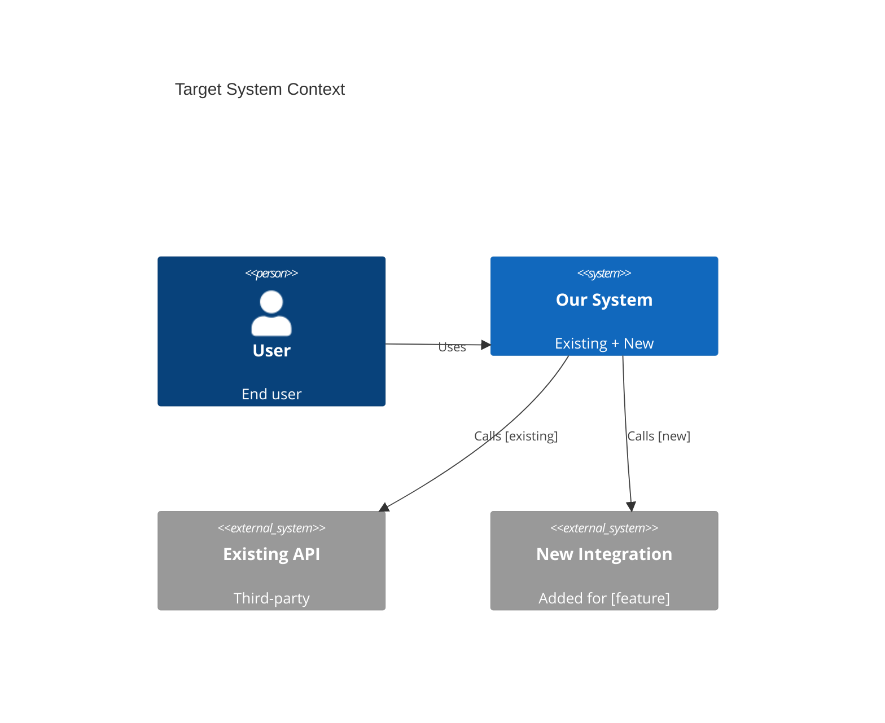
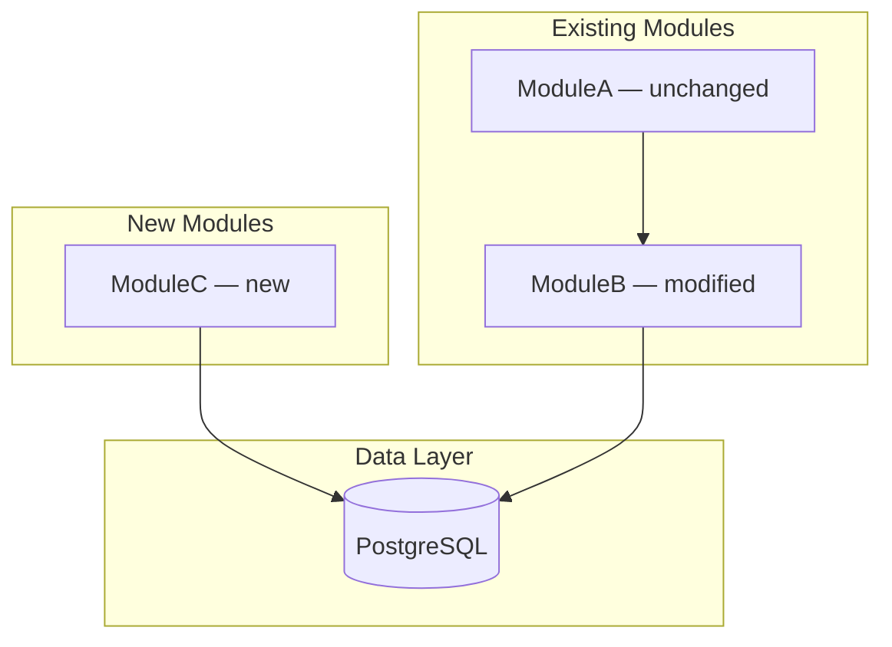
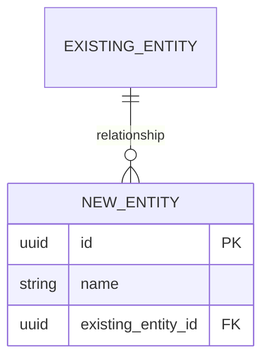

# Brownfield - Target Architecture Design

## Agent

**ARCHITECT**

## Before Starting

1. Read `SPEC/agents/AIRE_ARCHITECT.md`
2. Read `SPEC/rulebooks/aire-brownfield-rulebook.md`
3. Read `SPEC/rulebooks/aire-clean-architecture.md`
4. **MANDATORY**: Verify brownfield analysis outputs exist (see Prerequisites below)

---

## Prerequisites (MUST be completed before this workflow)

1. **System Overview must exist**: Check if `docs/architecture/current/00-system-overview.md` exist
   - If not found → tell user to run `aire-brownfield-inspect` first
2. **Deep-Dive analysis must exist**: Check if  `docs/architecture/current/01-*-deep-dive.md` exist
   - If not found → tell user to run `aire-brownfield-deep-dive` first
3. **Requirements must exist**: Check if `docs/requirements.md` exist 
   - If not found → tell user to run `aire-brownfield-requirements` first

**Check all three before proceeding**:

```
Checking prerequisites...

[If all exist]
✅ Prerequisites found:
   ✓ System overview: docs/architecture/current/00-system-overview.md
   ✓ Deep-dive: docs/architecture/current/[files found]
   ✓ Requirements: docs/requirements.md

Proceeding to target architecture design...

[If any is missing]
⚠️ Missing Required Analysis

[If system overview missing]
❌ docs/architecture/current/00-system-overview.md not found
   → Please run: aire-brownfield-inspect

[If deep-dive missing]
❌ No deep-dive analysis found in docs/architecture/current/
   → Please run: aire-brownfield-deep-dive

[If requirements missing]
❌ docs/requirements.md not found
   → Please run: aire-brownfield-requirements

Run the missing workflows first, then return here.
```

---

## STEP 0: Reference Check (MANDATORY FIRST)

- [ ] List all files in `SPEC/references/`
- [ ] For `.docx`/`.pdf`: Run `aire read SPEC/references/<file>` (if fails, ask user)
- [ ] Read `.md`/`.txt` files directly
- [ ] View images/designs — note architecture diagrams and design decisions
- [ ] Check `SPEC/references/builds/` — run `aire read` for `.docx`/`.pdf`, read others directly
- [ ] **NEVER proceed without reading ALL reference documents**
- [ ] Confirm to user what reference documents were found and processed

---

## Execution Steps:

### Phase 0: Load Existing Context

1. **Read System Overview**
   - [ ] Read `docs/architecture/current/00-system-overview.md`
   - [ ] Extract: current architecture style, tech stack, modules, entry points, external dependencies

2. **Read Deep-Dive Analysis**
   - [ ] Read all `docs/architecture/current/01-*-deep-dive.md` files
   - [ ] Extract: existing patterns, data models, API contracts, component breakdown

3. **Read Requirements**
   - [ ] Read `docs/requirements.md`
   - [ ] Extract: functional requirements, success criteria, technical constraints, scope (IN/OUT/IMPACT)
   - [ ] Identify: what needs to be added, what needs to be modified, what must stay unchanged, which modules are directly   affected by the new requirements, integration points for new changes, existing constraints

4. **Summarise Delta**
   - [ ] Present to user:
     ```
     📊 Impact Analysis:

     Existing System: [architecture style, tech stack summary]

     Affected Modules: [list from requirements + deep-dive mapping]
     New Modules Needed: [list]
     Modified Modules: [list]
     Unchanged Modules: [list]

     Proceeding to target architecture design...
     ```

---

### Phase 1: Design Decisions (Delta Analysis)

5. **Analyse Impact**
   - [ ] Map each requirement to affected existing modules
   - [ ] Identify new modules/components needed
   - [ ] Identify existing components requiring modification
   - [ ] Identify potential breaking changes and backward compatibility risks
   - [ ] Identify data model changes required

6. **Technology Selection** (only for new technology needs)

   For each new technology choice:
   - [ ] List options considered (minimum 2)
   - [ ] Evaluate pros/cons against existing tech stack
   - [ ] Make recommendation aligned with existing technology choices
   - [ ] Document rationale
   - [ ] Confirm with user before proceeding

   If no new technology is needed:
   ```
   ✅ No new technology required — all changes use existing stack.
   ```

7. **Architecture Style Decision** (for new components)
   - [ ] Follow existing architecture style unless requirements mandate a different approach
   - [ ] Document any deviation from current architecture style and the reason
   - [ ] Validate that new components integrate cleanly into existing layers

---

### Phase 2: Target State Design

8. **Create Target System Context**
   - [ ] Extend the existing system context from `docs/architecture/current/00-system-overview.md`
   - [ ] Highlight: new actors, new external integrations, changed data flows
   - [ ] Create updated context diagram (Mermaid) clearly marking new vs existing elements
   - [ ] Document data flows for new features

9. **Design New/Modified Component Architecture**
   - [ ] Map new components to existing layer structure (follow same layering)
   - [ ] Define interfaces between new and existing components
   - [ ] Identify contracts that must not change (backward compatibility boundaries)
   - [ ] Define any new component dependencies
   - [ ] Create component delta diagram (Mermaid) — annotate which are new, which are modified

10. **Design Data Architecture Changes**
    - [ ] Identify new entities and their relationships to existing entities
    - [ ] Plan schema migrations — prefer additive changes (new tables/columns) over destructive ones
    - [ ] Document impact on existing data models (foreign keys, constraints)
    - [ ] Create updated ER diagram (Mermaid) — annotate new vs existing entities
    - [ ] Define migration strategy (zero-downtime vs maintenance window)

11. **Design API Contract Changes**

    For each new or modified endpoint:
    - [ ] Define request format (backward compatible unless breaking change is justified)
    - [ ] Define success response
    - [ ] Define error responses (consistent with existing error format)
    - [ ] Document authentication/authorization requirements
    - [ ] Flag any breaking changes explicitly — these require versioning or migration plan

12. **Design Security for New Features**
    - [ ] Authentication requirements for new endpoints (consistent with existing auth)
    - [ ] Authorization model for new features (roles, permissions)
    - [ ] Data protection for new entities (encryption, masking)
    - [ ] Security boundaries for new integrations

---

### Phase 3: Documentation

13. **Design Error Handling** (for new components, if extending existing approach)
    - [ ] Error categories for new features
    - [ ] Error response format (must be consistent with existing)
    - [ ] Retry strategies for new external integrations
    - [ ] Fallback behaviors

14. **Design Observability** (for new components)
    - [ ] Logging additions for new code (consistent with existing logging pattern)
    - [ ] Metrics to add for new features
    - [ ] Alerts for new failure modes
    - [ ] Monitoring approach for new integrations

15. **Create Target Architecture Document at `docs/architecture/design/02-target-architecture-brownfield.md`**
    - [ ] Current state summary (pulled from inspect/deep-dive)
    - [ ] Target state with all changes clearly highlighted
    - [ ] Delta table: what is new, what is modified, what is unchanged
    - [ ] Migration approach (how to move from current to target state safely)
    - [ ] Component diagrams (current and target)
    - [ ] Data model changes (migration plan included)
    - [ ] API contracts (new and modified endpoints)
    - [ ] Security design for new features
    - [ ] Decision records for all major choices

16. **Generate Architecture Diagram Preview**
    - [ ] Extract all Mermaid diagrams from `docs/architecture/design/02-target-architecture-brownfield.md`
    - [ ] Create `docs/architecture-diagrams/02-target-architecture-diagrams-brownfield.md` with ONLY Mermaid diagrams and section headings
    - [ ] Confirm diagram `.md` file renders correctly
    - [ ] Use the Diagram Preview Template (see below)

17. **Request Approval**
    - [ ] Present target architecture document to user
    - [ ] Address questions and concerns
    - [ ] Get formal approval before proceeding

---

### Phase 4: Update docs/status.md (MANDATORY)

- [ ] **Read `SPEC/templates/STATUS_FORMAT.md`** — mandatory format for status.md
- [ ] Read existing `docs/status.md` first; if it does not exist, create it using `SPEC/templates/STATUS_FORMAT.md` format
- [ ] Updates to make:
  - **Updated By** → `ARCHITECT`
  - **Overall Status** → `🟡 IN PROGRESS`
  - **Current Step** → "Target Architecture complete"
  - **Progress Summary** → Set "Target Architecture" row to `✅ Done` with evidence: `docs/architecture/design/02-target-architecture-brownfield.md`
  - **Current Step Details** → Mark all target architecture phases complete
  - **Completed Steps** → Add target architecture with evidence: `docs/architecture/design/02-target-architecture-brownfield.md`
  - **Upcoming** → `aire-brownfield-patterns`
  - **Agent Activity** → Update ARCHITECT to Idle

Report to user:
```
✅ docs/status.md updated
   Step: Target Architecture → ✅ Done
   Next: Run aire-brownfield-patterns
```

---

## Output

**Primary (LLM-optimized)**: `docs/architecture/design/02-target-architecture-brownfield.md`

**Contents**:
- Current state summary (from inspect + deep-dive)
- Target state with annotated changes
- Delta table (new / modified / unchanged)
- Migration approach
- Updated component diagrams
- Data model changes + migration plan
- API contracts (new and modified)
- Security design for new features
- Decision records

### Target Architecture Document Template

```markdown
# Target Architecture - [Project Name]

**Date**: [YYYY-MM-DD]
**Author**: ARCHITECT
**Status**: [Draft / Approved]
**Version**: [1.0]
**Based On**: docs/architecture/current/00-system-overview.md + docs/requirements.md

---

## Overview

### Current System
[Brief 2-3 sentence summary of the existing system from 00-system-overview.md]

### What We Are Changing
[Brief description of what the requirements ask us to add/modify]

### Architecture Approach
[Confirm: same architecture style extended, or new pattern introduced and why]

---

## Delta Summary

| Component | Status | Change Description |
|-----------|--------|--------------------|
| [ModuleA] | 🟢 Unchanged | No modification required |
| [ModuleB] | 🟡 Modified | Add new endpoint for [feature] |
| [ModuleC] | 🆕 New | New service for [capability] |
| [TableX]  | 🟡 Modified | Add [column] — additive migration |
| [TableY]  | 🆕 New | Store [new entity] |

---

## Technology Stack

| Category | Technology | Version | Status | Notes |
|----------|------------|---------|--------|-------|
| [Existing tech] | [X] | [V] | 🟢 Unchanged | |
| [New tech] | [X] | [V] | 🆕 Added | [Rationale] |

---

## Target System Context



---

## Component Architecture (Target)



---

## Data Model Changes

### New Entities



### Migration Plan

| Step | Action | Risk | Rollback |
|------|--------|------|---------|
| 1 | Add [column] to [table] — nullable | Low | DROP COLUMN |
| 2 | Backfill [column] | Medium | Set to NULL |
| 3 | Add NOT NULL constraint | Low | Drop constraint |

---

## API Changes

### New Endpoints

| Method | Path | Description | Auth |
|--------|------|-------------|------|
| POST | /[resource] | Create [resource] | Bearer |
| GET | /[resource]/:id | Get [resource] | Bearer |

### Modified Endpoints

| Method | Path | Change | Breaking? |
|--------|------|--------|-----------|
| GET | /[existing] | Add [field] to response | No |

---

## Security Design

[Authentication, authorization, data protection for new features]

---

## Technical Decisions

[Decision records for major choices made during this workflow]
```

---

### Architecture Diagram Preview Template

> **Purpose**: Human-readable `.md` file containing ONLY Mermaid diagrams for easy preview.
> **Location**: `docs/architecture-diagrams/`
> **Rule**: Extract diagrams from the `.md` file. Do NOT duplicate other content.

```markdown
# Target Architecture Diagrams - [Project Name]

**Source**: `docs/architecture/design/02-target-architecture-brownfield.md`
**Generated**: [YYYY-MM-DD]

> Mermaid diagrams extracted from the target architecture document for easy preview.

---

## Target System Context Diagram

```mermaid
[Paste System Context diagram from .md file]
```

---

## Component Architecture (Target)

```mermaid
[Paste Component Architecture diagram from .md file]
```

---

## Data Model Changes

```mermaid
[Paste ER diagram from .md file]
```
```

---

## Rules

- 🔴 Document all decisions with rationale
- 🔴 Include at least 2 alternatives considered for new technology choices
- 🔴 Prefer additive changes — avoid breaking existing contracts
- 🔴 Annotate all diagrams: new vs existing vs modified
- 🔴 Get user approval before proceeding

---

**Type "proceed" to start target architecture design.**

---

## Mandatory Next Steps to suggest user

**You are here → `aire-brownfield-architecture`**

| # | Next Command | Purpose |
|---|-------------|---------|
| ▶️ | `aire-brownfield-patterns` | Define coding patterns and standards (existing vs recommended) |
