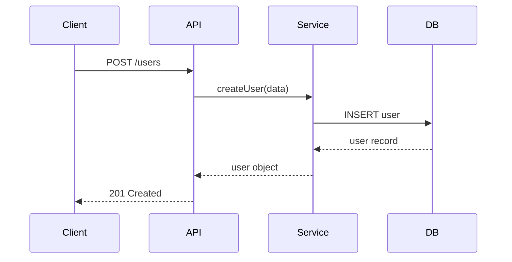

# Brownfield - Deep-Dive Analysis

## Agent

**ARCHITECT**

## Before Starting

1. Read `SPEC/agents/AIRE_ARCHITECT.md`
2. Read `SPEC/rulebooks/aire-brownfield-rulebook.md`
3. Verify system overview exists: `docs/architecture/current/00-system-overview.md` if not tell user to first run workflow `aire-brownfield-inspect`


---

## Prerequisite: Scoping the Analysis
Before starting, you must ask the user to specify which module or component they want to analyze. Provide them with the following examples to guide their request:

- `"deep-dive auth module"`
- `"analyze user service"`
- `"deep-dive database layer"`
- `"deep-dive full system"` (Note: This instructs you to sequentially analyze ALL modules from the system overview).

Do not proceed with the analysis until the user has defined the scope.

---
Once the user has confirmed the scope, immediately execute the following steps for the targeted module(s):

## Execution Steps:

### Phase 1: Module Analysis
- [ ] List all files in module
- [ ] Identify main classes/functions
- [ ] Identify interfaces/contracts
- [ ] Map internal/external dependencies

### Phase 2: Flow Analysis
- [ ] Identify main workflows
- [ ] Trace request/data flows
- [ ] Create sequence diagrams (Mermaid)
- [ ] Document state transitions

### Phase 3: Data Analysis
- [ ] Identify data models
- [ ] Map database tables
- [ ] Document relationships
- [ ] Create ER diagrams

### Phase 4: Pattern Extraction
Extract and document with code examples:
- [ ] Error handling patterns
- [ ] Logging patterns
- [ ] Database access patterns
- [ ] API response patterns
- [ ] Naming conventions
- [ ] Test patterns

### Phase 5: Documentation
- [ ] Create `docs/architecture/current/01-[module]-deep-dive.md`
- [ ] Present to user for confirmation

### Phase 6: Architecture Diagram Preview (for BA/User)
- [ ] Extract all Mermaid diagrams (sequence, ER, flow) from the deep-dive `.md` file
- [ ] Create `docs/architecture-diagrams/01-[module]-deep-dive-diagrams.md` containing ONLY the Mermaid diagrams with section headings for easy preview
- [ ] Confirm diagram `.md` file renders correctly

### Phase 7: Update docs/status.md (MANDATORY)

- [ ] **Read `SPEC/templates/STATUS_FORMAT.md`** — mandatory format for status.md
- [ ] Read existing `docs/status.md` first (should exist from `aire-brownfield-inspect`)
- [ ] If it does not exist, create it using `SPEC/templates/STATUS_FORMAT.md` format
- [ ] Updates to make:
  - **Updated By** → `ARCHITECT`
  - **Overall Status** → `🟡 IN PROGRESS`
  - **Current Step** → "Deep-Dive complete"
  - **Progress Summary** → Set "Deep-Dive" row to `✅ Done` with evidence path
  - **Current Step Details** → Mark all deep-dive phases complete for the analyzed module(s)
  - **Completed Steps** → Add deep-dive file(s): `docs/architecture/current/01-[module]-deep-dive.md`
  - **Upcoming** → `aire-brownfield-requirements`
  - **Agent Activity** → Update ARCHITECT to Idle

Report to user:
```
✅ docs/status.md updated
   Step: Deep-Dive → ✅ Done
   Next: Run aire-brownfield-requirements
```

---

## Output

**Primary (LLM-optimized)**: `docs/architecture/current/01-[module]-deep-dive.md` (or if full system: one file per module `01-...`, `02-...`)

**Contents**:
- Module overview
- Component breakdown
- Sequence diagrams
- Data models
- Pattern catalog with code examples
- Entry points

### Deep-Dive Template

```markdown
# Deep-Dive - [Module Name]

**Date**: [YYYY-MM-DD]  
**Analyzed By**: ARCHITECT  
**Status**: [Draft / Confirmed]

---

## Module Overview

**Purpose**: [What does this module do?]  
**Path**: `[/path/to/module]`  
**Key Files**: [Number] files, [LOC] lines

---

## Component Breakdown

| Component | File | Responsibility |
|-----------|------|----------------|
| Controller | `user.controller.js` | HTTP handlers |
| Service | `user.service.js` | Business logic |
| Repository | `user.repository.js` | Data access |
| Model | `user.model.js` | Data model |

---

## Key Workflows

### Workflow: [Name]



**Stories**:
1. [Story 1]
2. [Story 2]
3. [Story 3]

---

## Data Models

### Entity: User

| Field | Type | Constraints | Description |
|-------|------|-------------|-------------|
| id | UUID | PK | Unique identifier |
| email | VARCHAR(255) | UNIQUE, NOT NULL | User email |
| name | VARCHAR(255) | NOT NULL | Display name |

---

## Pattern Catalog

### Error Handling

**Pattern**: Centralized error handler with typed errors

**Example (from `src/middleware/errorHandler.js`)**:
```javascript
// DO: Use typed errors
throw new ValidationError('Invalid email format');

// DON'T: Use generic errors
throw new Error('Invalid email format');
```

### Logging

**Pattern**: Structured JSON logging with context

**Example (from `src/utils/logger.js`)**:
```javascript
// DO: Include context
logger.info('User created', { userId: user.id, email: user.email });

// DON'T: Log without context
logger.info('User created');
```

### Database Access

**Pattern**: Repository pattern with connection pooling

**Example (from `src/data/userRepository.js`)**:
```javascript
// DO: Use parameterized queries
const result = await pool.query('SELECT * FROM users WHERE id = $1', [id]);

// DON'T: String concatenation
const result = await pool.query(`SELECT * FROM users WHERE id = ${id}`);
```

---

## Testing Patterns

### Unit Test Pattern

**Location**: `tests/unit/`  
**Naming**: `[component].test.js`

**Example**:
```javascript
describe('UserService', () => {
  describe('createUser', () => {
    it('should create user with valid data', async () => {
      // Arrange
      const userData = { email: 'test@example.com', name: 'Test' };
      
      // Act
      const user = await userService.createUser(userData);
      
      // Assert
      expect(user).toHaveProperty('id');
    });
  });
});
```

---

## Entry Points

| Entry | Path | Method | Description |
|-------|------|--------|-------------|
| Create | `/users` | POST | Create user |
| Get | `/users/:id` | GET | Get user by ID |
| Update | `/users/:id` | PUT | Update user |
| Delete | `/users/:id` | DELETE | Delete user |

---

## Recommendations

1. [Recommendation 1]
2. [Recommendation 2]
```
```
**Diagram Preview (Human-readable)**: `docs/architecture-diagrams/01-[module]-deep-dive-diagrams.md`

**Contents**:
- All Mermaid diagrams (sequence, ER, flow) extracted from the `.md` file with section headings

---

## Rules

- 🔴 NO CODE CHANGES during analysis
- 🔴 All patterns must have code examples
- 🔴 Verify diagrams against actual code
- 🔴 Confirm understanding before proceeding

---

**Tell me which module to analyze (or "full system" for all), then type "proceed".**

---

## Mandatory Next Steps to suggest user

**You are here → `aire-brownfield-deep-dive`**

| # | Next Command | Purpose |
|---|-------------|---------|
| ▶️ | `aire-brownfield-requirements` | Define requirements based on existing system analysis |

