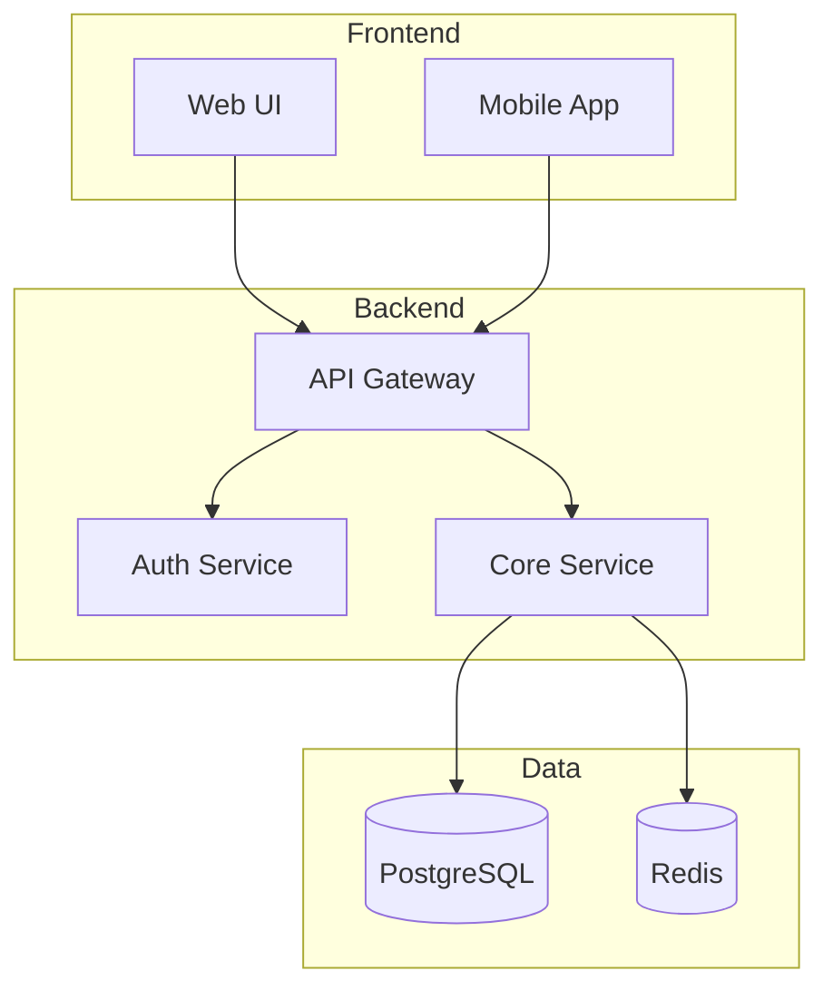

# Brownfield - System Discovery

## Agent

**ARCHITECT**

## Before Starting

1. Read `SPEC/agents/AIRE_ARCHITECT.md`
2. Read `SPEC/rulebooks/aire-brownfield-rulebook.md`


---

## Execution Steps:

### Phase 0: Reference Check (MANDATORY FIRST)
- [ ] List `SPEC/references/`
- [ ] For .docx/.pdf: `aire read SPEC/references/<file>` (if fails, ask user)
- [ ] Read .md/.md directly
- [ ] View images/designs - note architecture diagrams
- [ ] Confirm to user what legacy docs were found

### Phase 1: Initial Scan
- [ ] Identify root directory structure
- [ ] List major directories/modules
- [ ] Identify main entry points
- [ ] Identify configuration files
- [ ] Identify package/dependency files

### Phase 2: Technology Analysis
- [ ] Programming languages
- [ ] Frameworks
- [ ] Databases
- [ ] External services
- [ ] Build tools
- [ ] Testing frameworks

### Phase 3: Architecture Mapping
- [ ] Identify architectural style
- [ ] Map major subsystems
- [ ] Identify layer structure
- [ ] Create system diagram (Mermaid)

### Phase 4: Documentation
- [ ] Create `docs/architecture/current/00-system-overview.md`
- [ ] Present to user for confirmation

### Phase 5: Architecture Diagram Preview (for BA/User)
- [ ] Extract all Mermaid diagrams from `docs/architecture/current/00-system-overview.md`
- [ ] Create `docs/architecture-diagrams/00-system-overview-diagrams.md` containing ONLY the Mermaid diagrams with section headings for easy preview
- [ ] Confirm diagram `.md` file renders correctly

### Phase 6: Update docs/status.md (MANDATORY)

- [ ] **Read `SPEC/templates/STATUS_FORMAT.md`** — mandatory format for status.md
- [ ] If `docs/status.md` does not exist, create it using the format in `SPEC/templates/STATUS_FORMAT.md`
- [ ] If it exists, read it first, then update only the changed sections
- [ ] Updates to make:
  - **Updated By** → `ARCHITECT`
  - **Overall Status** → `🟡 IN PROGRESS`
  - **Current Step** → "System Discovery complete"
  - **Progress Summary** → Set "System Discovery" row to `✅ Done` with evidence path
  - **Current Step Details** → Mark all discovery phases complete
  - **Completed Steps** → Add system overview with evidence: `docs/architecture/current/00-system-overview.md`
  - **Upcoming** → `aire-brownfield-deep-dive`, then `aire-brownfield-requirements` → `aire-brownfield-architecture` → `aire-brownfield-patterns` → `aire-brownfield-plan`
  - **Agent Activity** → Update ARCHITECT to Idle

Report to user:
```
✅ docs/status.md created/updated
   Step: System Discovery → ✅ Done
   Next: Run aire-brownfield-deep-dive
```

---

## Output

**Primary (LLM-optimized)**: `docs/architecture/current/00-system-overview.md`

**Contents**:
- System architecture diagram
- Technology stack table
- Module/subsystem breakdown
- Entry points
- External dependencies
- Test infrastructure

----
### System Overview Template

```markdown
# System Overview - [Project Name]

**Date**: [YYYY-MM-DD]  
**Analyzed By**: ARCHITECT  
**Status**: [Draft / Confirmed]

---

## Executive Summary

[Brief 2-3 sentence description of what this system does]

---

## System Architecture

### Architecture Diagram



### Architecture Style
[Monolith / Microservices / Serverless / etc.]

---

## Technology Stack

| Category | Technology | Version | Notes |
|----------|------------|---------|-------|
| Language | Node.js | 18.x | LTS |
| Framework | Express | 4.x | REST API |
| Database | PostgreSQL | 14 | Primary data store |
| Cache | Redis | 7.x | Session & caching |
| Testing | Jest | 29.x | Unit & integration |

---

## Module Overview

| Module | Path | Responsibility | Dependencies |
|--------|------|----------------|--------------|
| API | `/src/api` | HTTP handlers, routing | Core, Auth |
| Core | `/src/core` | Business logic | Data |
| Data | `/src/data` | Database access | PostgreSQL |
| Auth | `/src/auth` | Authentication | JWT, bcrypt |

---

## Entry Points

| Type | Path/Command | Description |
|------|--------------|-------------|
| HTTP | `src/index.js` | Main server entry |
| CLI | `bin/cli.js` | Admin commands |
| Worker | `src/worker.js` | Background jobs |

---

## External Dependencies

### NPM Packages (Key)
| Package | Purpose |
|---------|---------|
| express | Web framework |
| pg | PostgreSQL driver |
| jsonwebtoken | JWT handling |

### External Services
| Service | Purpose | Integration |
|---------|---------|-------------|
| Stripe | Payments | REST API |
| SendGrid | Email | SMTP/API |

---

## Design References (Legacy Documentation)

**Location**: `SPEC/references/`

| File | Type | Description | Relevance |
|------|------|-------------|-----------|
| [filename.pdf] | Architecture | [Legacy system diagram] | System architecture |
| [filename.docx] | Spec | [Original requirements] | Feature context |
| [filename.png] | UI Design | [Current UI mockup] | Frontend reference |

**Note**: All legacy design files documented for context. New features should reference these when maintaining consistency.

---

## Test Infrastructure

| Type | Location | Framework | Coverage |
|------|----------|-----------|----------|
| Unit | `tests/unit/` | Jest | ~75% |
| Integration | `tests/integration/` | Jest + Supertest | ~60% |

---

## Configuration

| File | Purpose |
|------|---------|
| `.env` | Environment variables |
| `config/default.js` | Default config |
| `config/production.js` | Production overrides |

---

## Key Observations

### Strengths
- [Observation 1]
- [Observation 2]

### Areas of Concern
- [Concern 1]
- [Concern 2]

### Technical Debt
- [Debt item 1]
- [Debt item 2]
```
---
```
**Diagram Preview (Human-readable)**: `docs/architecture-diagrams/00-system-overview-diagrams.md`

**Contents**:
- All Mermaid diagrams extracted from the `.md` file with section headings

---

## Rules

- 🔴 NO CODE CHANGES during analysis
- 🔴 Base docs on code, not READMEs
- 🔴 Verify findings against actual code
- 🔴 Confirm understanding before proceeding
- 🔴 Do NOT suggest `aire-brownfield-deep-dive` until Phases 0–6 are done, `docs/architecture/current/00-system-overview.md` is written and user-confirmed, and the diagram preview file exists. Until then, stay in this workflow.

---

**Type "proceed" to start system discovery.**

---

## Mandatory Next Steps in AIRE Workflow

**You are here → `aire-brownfield-inspect`**

| # | Next Command | Purpose |
|---|-------------|---------|
| ▶️ | `aire-brownfield-deep-dive` | Detailed analysis of specific subsystems |
