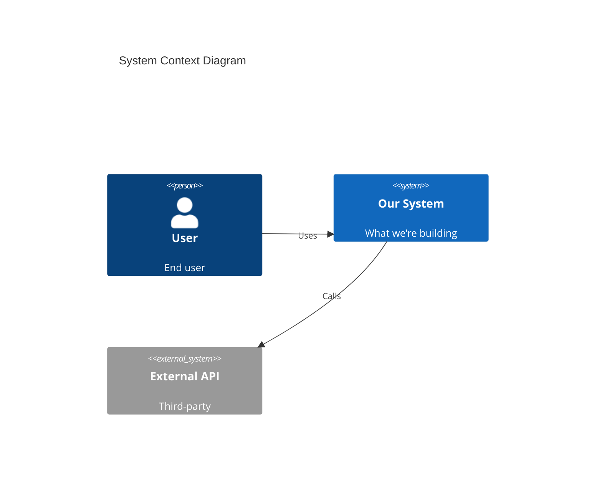
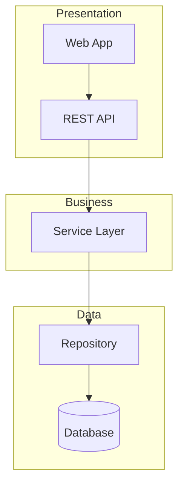
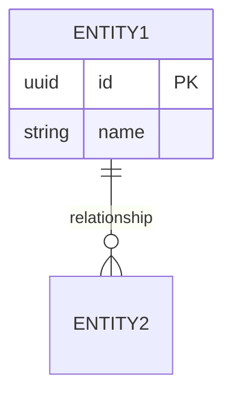

# Greenfield - Architecture Design


## Agent

**ARCHITECT** 

## Before Starting

1. Read `SPEC/agents/AIRE_ARCHITECT.md`
2. Read `SPEC/rulebooks/aire-greenfield-rulebook.md`
3. Read `SPEC/rulebooks/aire-clean-architecture.md`
4. **MANDATORY**: Check `SPEC/references/` folder for reference documents related to architecture.
5. **MANDATORY**: For ANY .docx or .pdf files found, run `aire read <file>` command BEFORE proceeding
6. **Read**: `docs/requirements.md` — if missing, **STOP**: Tell user to "Run `aire-greenfield-requirements` first."
7. Verify requirements are approved

---

## Execution Steps:

### Phase 0: Reference Document Check (MANDATORY FIRST STEP)
- [ ] List all files in `SPEC/references/` folder
- [ ] For EACH .docx file found: Run `aire read SPEC/references/<filename>.docx`
- [ ] For EACH .pdf file found: Run `aire read SPEC/references/<filename>.pdf`
- [ ] Read all .md files in `SPEC/references/`
- [ ] Read all other text-based reference files (.md, .txt, etc.)
- [ ] Check `SPEC/references/builds/` — run `aire read` for .docx/.pdf, read others directly
- [ ] **⚠️ Build docs = product release plan for this greenfield project. Do NOT treat as brownfield.**
- [ ] **If builds found**: architecture must cover ALL builds; note which components/layers are introduced per build
- [ ] **NEVER proceed without reading ALL reference documents**
- [ ] Confirm to user what reference documents were found and processed

#### Phase 1: Design Decisions

1. **Review Requirements**
   - [ ] Read requirements document
   - [ ] Identify architectural drivers
   - [ ] Identify non-functional requirements
   - [ ] Identify integration points

2. **Technology Selection**
   For each technology choice:
   - [ ] List options considered (minimum 2)
   - [ ] Evaluate pros and cons
   - [ ] Make recommendation
   - [ ] Document rationale
   - [ ] Confirm with user

3. **Architecture Style Decision**
   - [ ] Evaluate options (monolith, microservices, serverless)
   - [ ] Consider team size and skill
   - [ ] Consider scale requirements
   - [ ] Document decision and rationale

#### Phase 2: System Design

4. **Create System Context**
   - [ ] Identify all actors (users, systems)
   - [ ] Identify all external integrations
   - [ ] Create context diagram (Mermaid)
   - [ ] Document data flows

5. **Design Component Architecture**
   - [ ] Identify major components
   - [ ] Define responsibilities (single responsibility)
   - [ ] Define interfaces between components
   - [ ] Create component diagram (Mermaid)

6. **Design Data Architecture**
   - [ ] Identify entities and relationships
   - [ ] Choose database technology
   - [ ] Create data model
   - [ ] Create ER diagram (Mermaid)

7. **Design API Contracts**
   For each endpoint:
   - [ ] Define request format
   - [ ] Define success response
   - [ ] Define error responses
   - [ ] Document authentication requirements

8. **Design Security Architecture**
   - [ ] Authentication approach
   - [ ] Authorization model
   - [ ] Data protection strategy
   - [ ] Security boundaries
 
#### Phase 3: Documentation

9. **Design Error Handling**
   - [ ] Error categories
   - [ ] Error response format
   - [ ] Retry strategies
   - [ ] Fallback behaviors

10. **Design Observability**
    - [ ] Logging strategy
    - [ ] Metrics to collect
    - [ ] Alerting strategy
    - [ ] Monitoring approach

11. **Create Architecture Document at ``docs/architecture/design/00-system-architecture-greenfield.md`**
    - [ ] System overview
    - [ ] Context diagram
    - [ ] Component diagram
    - [ ] Data model
    - [ ] API contracts
    - [ ] Security design
    - [ ] Decision records

12. **Generate Architecture Diagram Preview**
    - [ ] Extract all Mermaid diagrams from the architecture `.md` file
    - [ ] Create `docs/architecture-diagrams/00-system-architecture-diagrams-greenfield.md` with ONLY Mermaid diagrams and section headings
    - [ ] Confirm diagram `.md` file renders correctly
    - [ ] Use the Diagram Preview Template (see below)

13. **Request Approval**
    - [ ] Present to user
    - [ ] Address questions
    - [ ] Get formal approval

### Phase 4: Update docs/status.md (MANDATORY)

- [ ] **Read `SPEC/templates/STATUS_FORMAT.md`** — mandatory format for status.md
- [ ] Read existing `docs/status.md` first; if it does not exist, create it using `SPEC/templates/STATUS_FORMAT.md` format
- [ ] Updates to make:
  - **Updated By** → `ARCHITECT`
  - **Overall Status** → `🟡 IN PROGRESS`
  - **Current Step** → "Architecture complete"
  - **Progress Summary** → Set "Architecture" row to `✅ Done` with evidence: `docs/architecture/design/00-system-architecture-greenfield.md`
  - **Current Step Details** → Mark all architecture phases complete
  - **Completed Steps** → Add architecture with evidence: `docs/architecture/design/00-system-architecture-greenfield.md`
  - **Upcoming** → `aire-greenfield-patterns`
  - **Agent Activity** → Update ARCHITECT to Idle

Report to user:
```
✅ docs/status.md updated
   Step: Architecture → ✅ Done
   Next: Run aire-greenfield-patterns
```

---

## Output

**Primary (LLM-optimized)**: `docs/architecture/design/00-system-architecture-greenfield.md`

**Contents**:
- System context diagram
- Component diagram
- Technology stack with justifications
- Data model
- API contracts
- Security design
- Decision records
### Architecture Document Template

```markdown
# System Architecture - [Project Name]

**Date**: [YYYY-MM-DD]  
**Author**: ARCHITECT
**Status**: [Draft / Approved]  
**Version**: [1.0]

---

## Overview

### Purpose
[Brief description of the system]

### Architecture Style
[Monolith / Microservices / Serverless / Hybrid]

### Key Drivers
- [Driver 1 from requirements]
- [Driver 2 from requirements]

---

## Technology Stack

| Category | Technology | Version | Justification |
|----------|------------|---------|---------------|
| Language | [X] | [Version] | [Why this choice] |
| Framework | [X] | [Version] | [Why this choice] |
| Database | [X] | [Version] | [Why this choice] |
| Cache | [X] | [Version] | [Why this choice] |
| Hosting | [X] | - | [Why this choice] |
| Testing | [X] | [Version] | [Why this choice] |

---

## System Context



---

## Component Architecture



---

## Data Model



---

## API Design

[Include key endpoints with contracts]

---

## Security Design

[Authentication, authorization, data protection]

---

## Technical Decisions

[Include decision records for major choices]
```
---
```
### Architecture Diagram Preview Template

> **Purpose**: Human-readable `.md` file containing ONLY Mermaid diagrams for easy preview by BA/users.
> **Location**: `docs/architecture-diagrams/`
> **Rule**: Extract diagrams from the `.md` file. Do NOT duplicate other content.

```markdown
# Architecture Diagrams - [Project Name]

**Source**: `docs/architecture/design/00-system-architecture-greenfield.md`
**Generated**: [YYYY-MM-DD]

> This file contains Mermaid diagrams extracted from the architecture document for easy preview.
> For full architecture details, refer to the source `.md` file.

---

## System Context Diagram

```mermaid
[Paste the System Context mermaid diagram from .md file]
```

---

## Component Architecture Diagram

```mermaid
[Paste the Component Architecture mermaid diagram from .md file]
```

---

## Data Model / ER Diagram

```mermaid
[Paste the ER diagram from .md file]
```

---

## [Additional Diagrams as needed]

```mermaid
[Paste any additional mermaid diagrams from .md file]
```

---
## Mandatory Next Steps to suggest user

**You are here → `aire-greenfield-architecture`**

| # | Next Command | Purpose |
|---|-------------|---------|
| ▶️ | `aire-greenfield-patterns` | Define coding patterns and standards |

## Rules

- 🔴 Document all decisions with rationale
- 🔴 Include at least 2 alternatives considered
- 🔴 Get user approval before proceeding

---

**Type "proceed" to start architecture design.**

---

