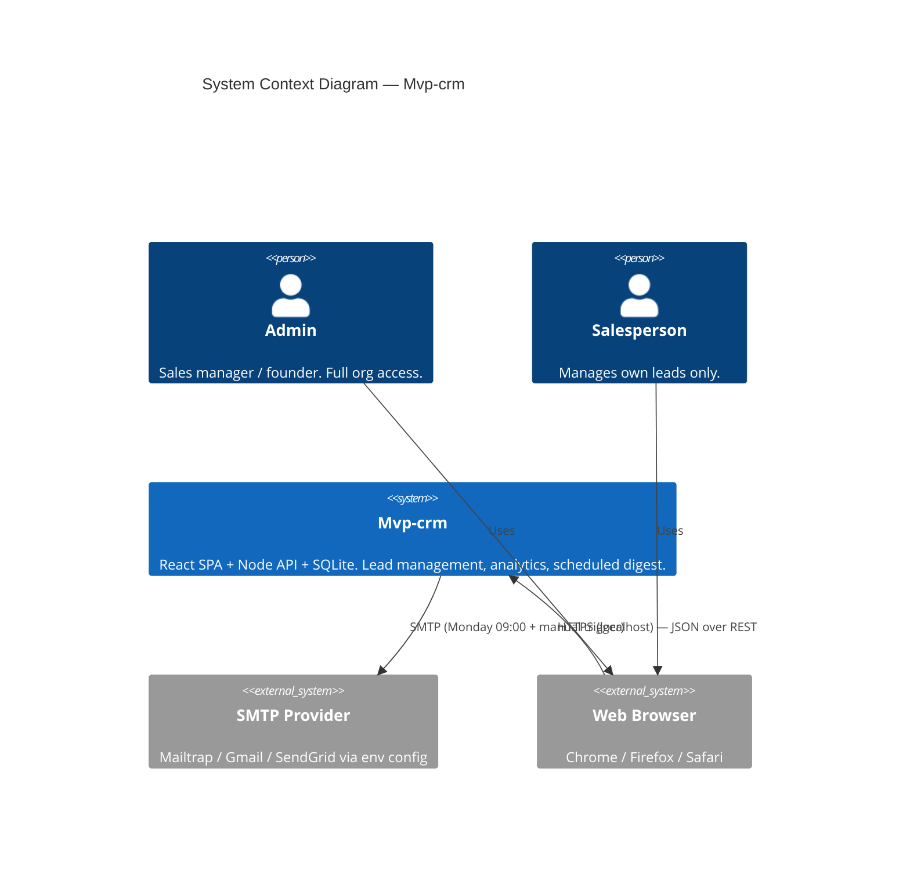
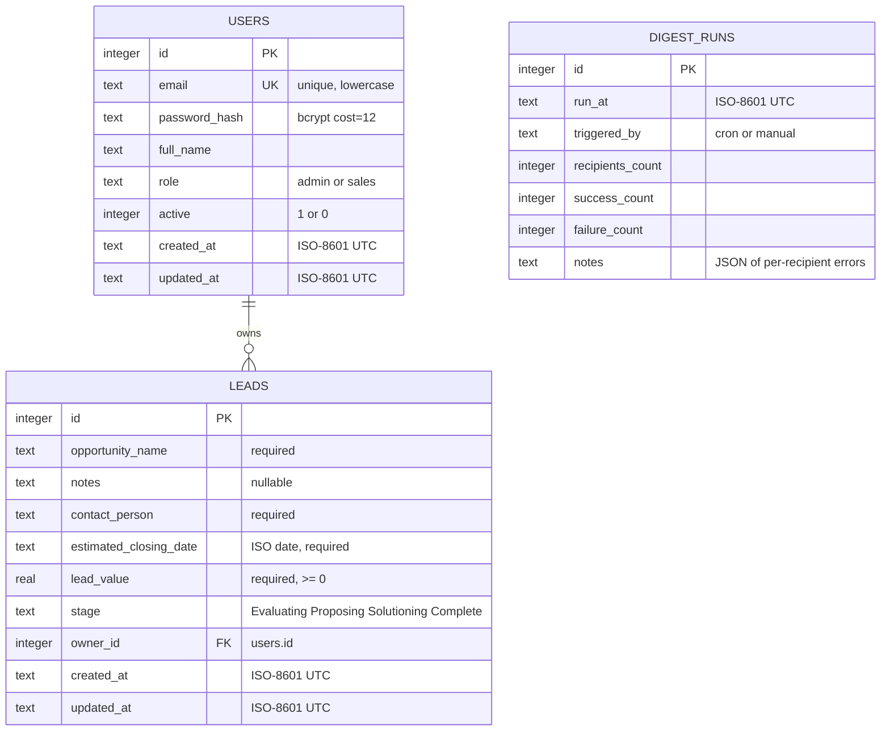

# Architecture Diagrams - Mvp-crm

**Source**: `docs/architecture/design/00-system-architecture-greenfield.md`
**Generated**: 2026-05-19

> This file contains Mermaid diagrams extracted from the architecture document for easy preview.
> For full architecture details, refer to the source `.md` file.

---

## System Context Diagram



---

## Component Architecture Diagram

```mermaid
flowchart TB
  subgraph Browser["Browser (React SPA — Vite)"]
    direction TB
    Pages[Pages: Login, Leads, LeadDetail, Dashboard, Users]
    RQ[TanStack Query Cache]
    AuthCtx[Auth Context — JWT in memory + localStorage]
    Pages --> RQ
    Pages --> AuthCtx
  end

  subgraph Backend["Node.js Backend (Express, single process)"]
    direction TB
    Mw[HTTP Middleware: cors, json, pino-http, errorHandler]
    AuthMw[authMiddleware — verifies JWT, attaches req.user]
    RoleMw[requireRole — enforces admin / scoping]

    subgraph Routes
      AuthR[/auth/]
      UsersR[/users/ — admin only]
      LeadsR[/leads/]
      AnalyticsR[/analytics/]
      AdminR[/admin/digest/run/]
    end

    subgraph Services
      AuthSvc[authService]
      UserSvc[userService]
      LeadSvc[leadService — applies role scope]
      AnalyticsSvc[analyticsService]
      DigestSvc[digestService]
    end

    subgraph Repos
      UserRepo[userRepository]
      LeadRepo[leadRepository]
    end

    Scheduler[node-cron Scheduler — Mon 09:00]
    Mailer[Nodemailer Transporter]
    DB[(SQLite — WAL, file-backed)]

    Mw --> AuthMw --> RoleMw --> Routes
    AuthR --> AuthSvc
    UsersR --> UserSvc
    LeadsR --> LeadSvc
    AnalyticsR --> AnalyticsSvc
    AdminR --> DigestSvc
    AuthSvc --> UserRepo
    UserSvc --> UserRepo
    LeadSvc --> LeadRepo
    AnalyticsSvc --> LeadRepo
    DigestSvc --> LeadRepo
    DigestSvc --> UserRepo
    DigestSvc --> Mailer
    Scheduler --> DigestSvc
    UserRepo --> DB
    LeadRepo --> DB
  end

  SMTP[(SMTP Provider)]

  Browser -- "fetch /api/* + Bearer JWT" --> Mw
  Mailer --> SMTP
```

---

## Data Model / ER Diagram


