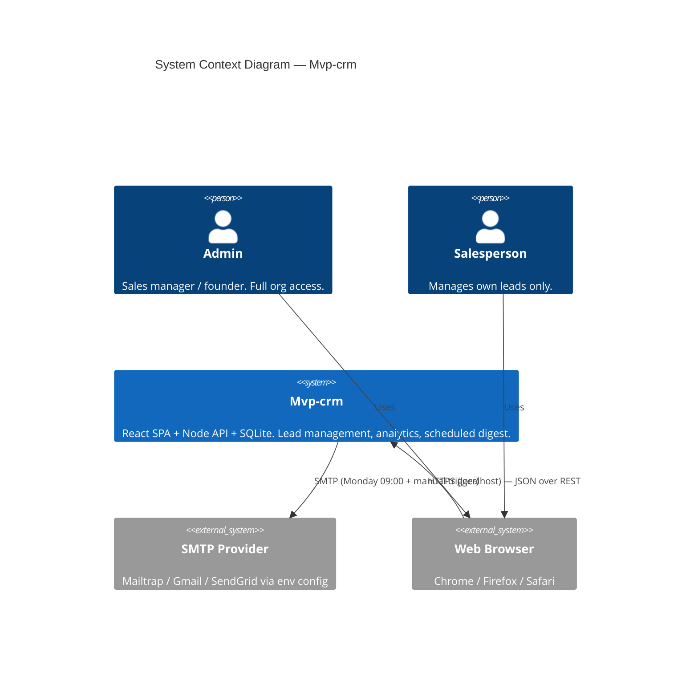
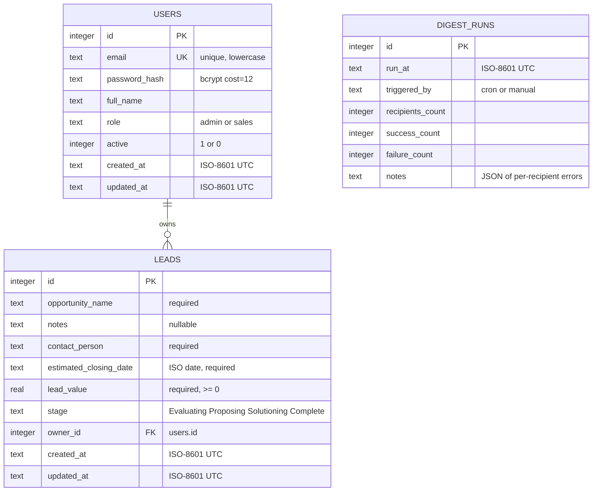

# System Architecture - Mvp-crm

**Date**: 2026-05-19
**Author**: ARCHITECT
**Status**: Draft
**Version**: 1.0

---

## Overview

### Purpose
Mvp-crm is a single-organization, lightweight CRM web application. The architecture must deliver, within a 4-week MVP timeline, a secure role-scoped lead-management system, a small analytics dashboard, and a weekly automated email digest — running entirely on a developer laptop with no cloud dependency.

### Architecture Style
**Modular Monolith** — a single Node.js process exposing a REST API plus an in-process scheduler, with a separate React SPA. Chosen over microservices/serverless because:
- Single-org MVP scale (≤20 concurrent users)
- 4-week timeline favors operational simplicity
- SQLite file DB makes process-local data access trivial; splitting services would force an artificial network boundary
- No cloud deploy in scope → no platform reason to fragment

Within the backend monolith, code is organized into feature modules (`auth`, `users`, `leads`, `analytics`, `digest`) following a layered pattern (routes → services → repositories).

### Key Drivers
- **Role isolation** (SC-2/3, FC-1) — every data read scoped server-side by user role
- **Polished MVP in 4 weeks** — favor stable, well-documented libs over novelty
- **Scheduled job correctness** (SC-7, FC-3) — Monday digest must observably fire
- **p95 < 500ms on 1k leads** (SC-9) — well within SQLite + Node capability if queries use indexes
- **≥85% test coverage** (SC-10) — architecture must be unit-testable (no static singletons, no hidden globals)
- **Local-only deploy** — no infra layer, no container, no reverse proxy

---

## Technology Stack

| Category | Technology | Version | Justification |
|----------|------------|---------|---------------|
| Frontend language | TypeScript | 5.x | Type safety on UI lowers bug rate; React 18+ ecosystem is TS-first |
| Frontend framework | React | 18.x | Required by user |
| Frontend build | Vite | 5.x | Fast dev server + sane defaults; lighter than CRA (deprecated) |
| Frontend routing | React Router | 6.x | De-facto standard for SPA routing |
| Frontend data | TanStack Query (React Query) | 5.x | Server-state cache, retries, invalidation — eliminates manual loading/error boilerplate |
| Charts | Recharts | 2.x | User-selected; composable React components, tree-shakeable, two bar charts is its sweet spot |
| Styling | Tailwind CSS | 3.x | Utility-first, no CSS-in-JS runtime cost, fastest to ship a polished MVP |
| Backend language | TypeScript | 5.x | Shared language with frontend; type-safe API contracts |
| Backend runtime | Node.js | 20 LTS | Required by user; LTS for stability |
| Backend framework | Express | 4.x | User-selected; widest ecosystem |
| Validation | Zod | 3.x | Schema-first request validation; types inferred for handlers |
| DB | SQLite | 3.45+ | Required by user; WAL mode for concurrent reads |
| DB client | better-sqlite3 | 11.x | User-selected; synchronous, fastest, no async overhead, prepared-statement caching |
| Migrations | Numbered `.sql` files + tiny in-house runner | n/a | Avoids ORM dependency; transparent; 6 migrations expected |
| Auth | jsonwebtoken | 9.x | JWT HS256 |
| Password hashing | bcrypt | 5.x | cost=12; constant-time compare |
| Email | nodemailer | 6.x | User-selected; SMTP via env config |
| Scheduler | node-cron | 3.x | In-process cron, simple, fires on Monday 09:00; pairs with manual trigger endpoint for QA |
| Logging | pino | 9.x | Structured JSON to stdout; ~5× faster than Winston |
| Testing (BE) | Vitest + Supertest | 1.x / 7.x | Native ESM/TS, Jest-compatible API, faster than Jest |
| Testing (FE) | Vitest + React Testing Library + MSW | 1.x / 14.x / 2.x | Same runner as BE; MSW for API mocking |
| Lint/format | ESLint + Prettier | latest | Standard tooling |
| Repo | npm workspaces monorepo | npm 10 | User-selected: `/backend`, `/frontend`, root scripts |

### Decisions deferred to `aire-greenfield-patterns`
- Folder structure within each workspace
- Naming conventions (camelCase for code, snake_case for SQL columns is the leaning)
- Error class hierarchy
- Logging field conventions

---

## System Context



### Actors
- **Admin** — authenticated user with `role=admin`; can manage users and see all leads
- **Salesperson** — authenticated user with `role=sales`; sees only leads where `owner_id = self`
- **SMTP Provider** — external email relay configured per environment

### Data Flows
1. **Browser ↔ API** — JSON over HTTP on `localhost:4000` (API) and `localhost:5173` (Vite dev). Frontend proxies `/api` to backend.
2. **API → SQLite** — synchronous queries via better-sqlite3 (file at `backend/data/mvp-crm.db`)
3. **Scheduler → SMTP** — `node-cron` runs Mondays 09:00 server-local, iterates active Salespersons, builds digest, sends via Nodemailer
4. **Admin → Manual digest trigger** — `POST /api/admin/digest/run` invokes the same digest function as the cron job (used in QA)

---

## Component Architecture

```mermaid
flowchart TB
  subgraph Browser["Browser (React SPA — Vite)"]
    direction TB
    Pages[Pages: Login, Leads, LeadDetail, Dashboard, Users]
    RQ[TanStack Query Cache]
    AuthCtx[Auth Context — JWT in memory + localStorage]
    Pages --> RQ
    Pages --> AuthCtx
  end

  subgraph Backend["Node.js Backend (Express, single process)"]
    direction TB
    Mw[HTTP Middleware: cors, json, pino-http, errorHandler]
    AuthMw[authMiddleware — verifies JWT, attaches req.user]
    RoleMw[requireRole — enforces admin / scoping]

    subgraph Routes
      AuthR[/auth/]
      UsersR[/users/ — admin only]
      LeadsR[/leads/]
      AnalyticsR[/analytics/]
      AdminR[/admin/digest/run/]
    end

    subgraph Services
      AuthSvc[authService]
      UserSvc[userService]
      LeadSvc[leadService — applies role scope]
      AnalyticsSvc[analyticsService]
      DigestSvc[digestService]
    end

    subgraph Repos
      UserRepo[userRepository]
      LeadRepo[leadRepository]
    end

    Scheduler[node-cron Scheduler — Mon 09:00]
    Mailer[Nodemailer Transporter]
    DB[(SQLite — WAL, file-backed)]

    Mw --> AuthMw --> RoleMw --> Routes
    AuthR --> AuthSvc
    UsersR --> UserSvc
    LeadsR --> LeadSvc
    AnalyticsR --> AnalyticsSvc
    AdminR --> DigestSvc
    AuthSvc --> UserRepo
    UserSvc --> UserRepo
    LeadSvc --> LeadRepo
    AnalyticsSvc --> LeadRepo
    DigestSvc --> LeadRepo
    DigestSvc --> UserRepo
    DigestSvc --> Mailer
    Scheduler --> DigestSvc
    UserRepo --> DB
    LeadRepo --> DB
  end

  SMTP[(SMTP Provider)]

  Browser -- "fetch /api/* + Bearer JWT" --> Mw
  Mailer --> SMTP
```

### Layer responsibilities
| Layer | Responsibility | Forbidden |
|-------|----------------|-----------|
| **Routes** | Parse + validate request (Zod), call service, format response | DB queries, business rules |
| **Services** | Business logic, role-scope enforcement, orchestrate repos + external IO | HTTP concerns, raw SQL |
| **Repositories** | Prepared SQL statements, row-to-object mapping | Business rules, HTTP, validation |
| **Middleware** | Auth verification, role gating, error normalization, request logging | Business logic |
| **Scheduler / Mailer** | Cron registration, SMTP transport | Querying DB directly (must go through services) |

### Frontend feature folders
`/frontend/src/features/{auth,leads,users,dashboard}` — each has `api.ts` (TanStack Query hooks), `components/`, `pages/`. Shared UI in `/frontend/src/ui/`, shared types in `/frontend/src/types/`.

---

## Data Model



### Constraints and indexes
- `users.email` — UNIQUE NOT NULL, lowercased before insert
- `users.role` — CHECK IN ('admin','sales')
- `leads.stage` — CHECK IN ('Evaluating','Proposing','Solutioning','Complete')
- `leads.lead_value` — CHECK >= 0
- `leads.owner_id` — FK with `ON DELETE RESTRICT` (cannot delete a user with leads)
- Index `idx_leads_owner_id` — supports Salesperson list query (FC-1 protection + SC-9)
- Index `idx_leads_stage` — supports analytics aggregation by stage
- SQLite pragmas at boot: `journal_mode=WAL`, `foreign_keys=ON`, `synchronous=NORMAL`

### Seed
- One Admin user created by `npm run seed` (reads `SEED_ADMIN_EMAIL` / `SEED_ADMIN_PASSWORD` from `.env`). No first-run UI flow — protects against the FC-6 manual-SQL risk.

---

## API Design

**Base URL**: `http://localhost:4000/api`
**Auth**: `Authorization: Bearer <JWT>` on every endpoint except `POST /auth/login`
**Content-Type**: `application/json` for requests and responses
**Error envelope**:
```json
{ "error": { "code": "VALIDATION_ERROR", "message": "...", "details": [...] } }
```

### Auth
| Method | Path | Auth | Body | 200 Response | Errors |
|--------|------|------|------|--------------|--------|
| POST | `/auth/login` | none | `{email, password}` | `{token, user:{id,email,fullName,role}}` | 401 INVALID_CREDENTIALS |
| GET | `/auth/me` | any | — | `{id,email,fullName,role}` | 401 |

### Users (Admin only)
| Method | Path | Body | 200 Response | Errors |
|--------|------|------|--------------|--------|
| GET | `/users` | — | `[{id,email,fullName,role,active}]` | 401, 403 |
| POST | `/users` | `{email,fullName,role,password}` | `{id,email,fullName,role,active}` | 401, 403, 409 EMAIL_EXISTS, 422 VALIDATION_ERROR |
| PATCH | `/users/:id` | `{fullName?, role?, active?}` | `{id,...}` | 401, 403, 404 |

### Leads
| Method | Path | Auth | Body | 200 Response | Errors |
|--------|------|------|------|--------------|--------|
| GET | `/leads?stage=&search=` | any | — | `[{...}]` scoped by role | 401 |
| POST | `/leads` | any | `{opportunityName,contactPerson,estimatedClosingDate,leadValue,notes?}` | `{id,...}` | 401, 422 |
| GET | `/leads/:id` | any | — | `{...}` | 401, 403 NOT_OWNED, 404 |
| PATCH | `/leads/:id` | any | partial | `{...}` | 401, 403, 404, 422 |
| DELETE | `/leads/:id` | any | — | `{ok:true}` | 401, 403, 404 |
| POST | `/leads/:id/stage` | any | `{stage}` | `{...}` | 401, 403, 404, 422 INVALID_STAGE |

### Analytics
| Method | Path | Auth | 200 Response |
|--------|------|------|--------------|
| GET | `/analytics/leads-per-person` | any | `[{ownerId,ownerName,count}]` (Salesperson sees self only) |
| GET | `/analytics/leads-by-stage` | any | `[{stage,count}]` (Salesperson scoped) |

### Admin / Digest
| Method | Path | Auth | 200 Response |
|--------|------|------|--------------|
| POST | `/admin/digest/run` | admin | `{runId, recipients, successes, failures}` |
| GET | `/admin/digest/runs` | admin | `[...]` last 30 runs |

### Validation
Every body is parsed via a Zod schema in the route module; failures return 422 with the Zod issues list under `error.details`. Stage transitions validated against the enum (any-direction allowed per requirements).

---

## Security Design

### Authentication
- Login → bcrypt-compare(password, stored hash) → on success issue JWT HS256, 24h TTL
- JWT claims: `{ sub: userId, role, iat, exp }`. Frontend stores in `localStorage` keyed `mvp-crm-token`
- `authMiddleware` verifies signature + expiry → attaches `req.user = { id, role }` → 401 on any failure (no enumeration)

### Authorization
- `requireRole('admin')` middleware gates user-management and `/admin/*` routes
- For lead reads/writes: services accept `{ user, ... }` and apply scope in the repository call. Salesperson queries always add `WHERE owner_id = ?`. **Server is the single source of truth — JWT role is never trusted alone for data scoping; the user id from the JWT is used to constrain the query.**

### Threat model + mitigations
| Threat | Mitigation |
|--------|-----------|
| SQL injection | Only prepared statements (better-sqlite3 binds params). Lint rule bans string-concat in repo layer. |
| Cross-rep data leak (FC-1) | Scoped queries + integration tests with two-user fixtures asserting 0 rows / 404 on direct ID access |
| Password leak in logs | pino redaction config: `password`, `password_hash`, `authorization`, `token` |
| JWT secret leak | Loaded from `.env` (gitignored); `.env.example` ships placeholder; CI secret scanner enabled |
| Brute force on login | Rate limit `/auth/login` to 5 attempts / 15 min / IP (express-rate-limit in-memory store, MVP-acceptable) |
| CSRF | JWT in Authorization header (not a cookie) — CSRF not applicable. CORS allowlist `localhost:5173`. |
| XSS | React auto-escapes; no `dangerouslySetInnerHTML`. Notes field rendered as plain text. |
| Information disclosure on errors | Error handler returns generic message for 5xx; full stack only in server logs |

### Data protection
- Passwords: bcrypt cost=12 at rest
- JWT secret: 256-bit env var
- DB file: file-system permissions only (local-only MVP); no at-rest encryption in scope
- TLS: out of scope (localhost). Architecture supports adding a reverse proxy later without code change.

---

## Error Handling

### Categories
| Class | HTTP | When |
|-------|------|------|
| `ValidationError` | 422 | Zod parse failure |
| `UnauthorizedError` | 401 | Missing/invalid JWT, bad credentials |
| `ForbiddenError` | 403 | Authenticated but role/ownership disallows |
| `NotFoundError` | 404 | Resource missing or scoped-out (returned as 404, not 403, to prevent ID enumeration on cross-rep access) |
| `ConflictError` | 409 | Duplicate email, etc. |
| `InternalError` | 500 | Unexpected — full stack logged, generic message returned |

### Centralized error middleware
`errorHandler(err, req, res, next)` maps the class to status + `{error:{code,message,details?}}` envelope. Logs at level `error` for 5xx, `warn` for 4xx ≥ 401, `info` for 4xx < 401.

### Retry / fallback
- **API**: no automatic retries. Client (TanStack Query) retries idempotent GETs once on network error.
- **Digest job**: per-recipient try/catch — one SMTP failure does not abort the run; failures recorded in `digest_runs.notes`. Cron run that throws is caught at the scheduler boundary so the process survives.

---

## Observability

### Logging
- **Format**: pino structured JSON to stdout (one line per event)
- **Request log**: pino-http auto-logs each HTTP request with `reqId`, `method`, `url`, `statusCode`, `responseTimeMs`, `userId` (when authed)
- **Levels**: `info` (default), `debug` (verbose dev), `error` (5xx + scheduler failures), `warn` (auth failures, validation rejects)
- **Redaction**: `password`, `password_hash`, `req.headers.authorization`, `token`
- **Correlation**: `reqId` (uuid v4) generated by pino-http; included in error responses for support

### Metrics (MVP scope)
- Counter logging only — no Prometheus/StatsD for MVP
- `digest_runs` table is the metric store for the scheduled job (recipients, successes, failures)
- Admin can `GET /admin/digest/runs` to inspect the last 30 runs

### Alerting
- Out of scope for local-only MVP. Documented in future considerations.

### What we'd add post-MVP
- `/healthz` endpoint (trivial; can add now if desired — see decision DR-7)
- Per-request histogram via `prom-client`
- External APM (Datadog / New Relic) on cloud deploy

---

## Deployment View

Single-machine dev only. Two processes:

```
backend/  → node dist/server.js   (port 4000)
frontend/ → vite preview          (port 5173, dev)  OR  vite build → static files
```

Root `package.json` scripts:
- `npm run dev` — runs backend + frontend in parallel (via `concurrently`)
- `npm run seed` — seeds the Admin user
- `npm run digest:run` — invokes the digest CLI (same code path as the manual trigger endpoint)
- `npm test` — runs Vitest in both workspaces with coverage

Build cycles and cloud deploy are deferred to `aire-build-cycles` and the `aire-devops-*` workflows.

---

## Technical Decisions (Decision Records)

### DR-1 — Modular monolith over microservices
- **Context**: 4-week MVP, single-org, <20 concurrent users
- **Alternatives**: (a) Microservices (auth, leads, digest as separate services), (b) Serverless functions on cloud
- **Decision**: Monolithic Node process with feature modules
- **Rationale**: Microservices add network + deploy overhead that defeats the 4-week timeline; serverless is incompatible with a file-backed SQLite + an in-process cron
- **Consequences**: When traffic justifies it, the modules can be extracted; service interfaces are designed to remain stable

### DR-2 — better-sqlite3 + raw SQL over Prisma
- **Context**: SQLite mandated; schema is small (3 tables)
- **Alternatives**: (a) Prisma, (b) Knex, (c) Sequelize
- **Decision**: better-sqlite3 + prepared statements + hand-written migration files
- **Rationale**: Prisma's value (multi-DB, type-safe client) is not exercised here; its generation step adds 30+s to CI. Raw SQL keeps the query surface visible and the dependency tree small
- **Consequences**: Migrations must be hand-rolled; we ship a 30-line `migrate.ts` that runs ordered `.sql` files transactionally

### DR-3 — node-cron in-process over external scheduler
- **Context**: Weekly Monday 09:00 digest; local-only deploy
- **Alternatives**: (a) BullMQ + Redis, (b) OS-level cron calling a CLI
- **Decision**: `node-cron` running inside the API process
- **Rationale**: BullMQ needs Redis (extra infra for MVP); OS cron breaks dev parity. Risk that the job misfires if the dev machine sleeps — accepted; the `POST /admin/digest/run` manual trigger covers it
- **Consequences**: The job only runs when the API process is up. Documented in README; not a release blocker

### DR-4 — JWT in localStorage with no refresh token
- **Context**: 24h TTL acceptable per requirements (no refresh tokens in scope)
- **Alternatives**: (a) HttpOnly cookies + CSRF tokens, (b) JWT + refresh token rotation
- **Decision**: JWT in `localStorage`, sent via `Authorization: Bearer`
- **Rationale**: Simplest auth for an SPA on localhost; CSRF not applicable; refresh-token complexity not justified for an MVP
- **Consequences**: XSS in the React app would leak the token. Mitigated by React's default escaping and a ban on `dangerouslySetInnerHTML`

### DR-5 — TypeScript across the stack
- **Context**: Requirements not explicit on TS vs JS
- **Alternatives**: (a) Plain JavaScript, (b) JSDoc-typed JS
- **Decision**: TypeScript everywhere
- **Rationale**: Shared types between backend (Zod schemas → inferred types) and frontend reduce contract drift; ≥85% coverage target benefits from compile-time guarantees
- **Consequences**: Slight build setup overhead (Vite + tsx for backend) — paid once

### DR-6 — Tailwind over CSS-in-JS or CSS modules
- **Context**: "Polished MVP" UI in 4 weeks
- **Alternatives**: (a) Emotion / styled-components, (b) CSS Modules, (c) Mantine / Chakra component lib
- **Decision**: Tailwind 3 utility-first + a tiny `/ui` primitives folder (Button, Input, Card, Table)
- **Rationale**: Zero runtime cost; fastest iteration; no design system commitment locks
- **Consequences**: Class strings get long — encapsulate repeated combinations into the `/ui` primitives

### DR-7 — No `/healthz` endpoint for MVP
- **Context**: Local-only deploy; no orchestrator polling health
- **Alternatives**: Add `GET /healthz` returning 200
- **Decision**: Defer to DevOps phase
- **Rationale**: Nothing currently consumes it; adding endpoints to satisfy hypothetical future needs violates the MVP scope rule
- **Consequences**: Trivially added later (single route) if cloud deploy moves in scope

---

## Compliance with requirements

| Req | Architectural element |
|-----|----------------------|
| SC-2 / SC-3 / FC-1 (role isolation) | `requireRole`, scoped queries in `leadRepository`, integration tests with two-user fixtures |
| SC-4 (4 stages) | `leads.stage` CHECK constraint + Zod enum on `POST /leads/:id/stage` |
| SC-6 (2 bar charts) | `/analytics/leads-per-person` + `/analytics/leads-by-stage` + Recharts |
| SC-7 / FC-3 (Monday digest) | `node-cron` + `digestService` + `digest_runs` table + manual trigger endpoint |
| SC-8 (auth on every endpoint) | `authMiddleware` mounted before all `/api/*` routes except `/auth/login` |
| SC-9 (p95 < 500ms / 1k leads) | `idx_leads_owner_id`, `idx_leads_stage`, prepared statements, WAL |
| SC-10 (≥85% coverage) | Vitest + Supertest + RTL; services/repos pure-ish for unit testing |
| FC-2 (no plain-text passwords) | bcrypt at the only write site (`userService.create`) |
| FC-6 (no manual SQL bootstrap) | `npm run seed` |
