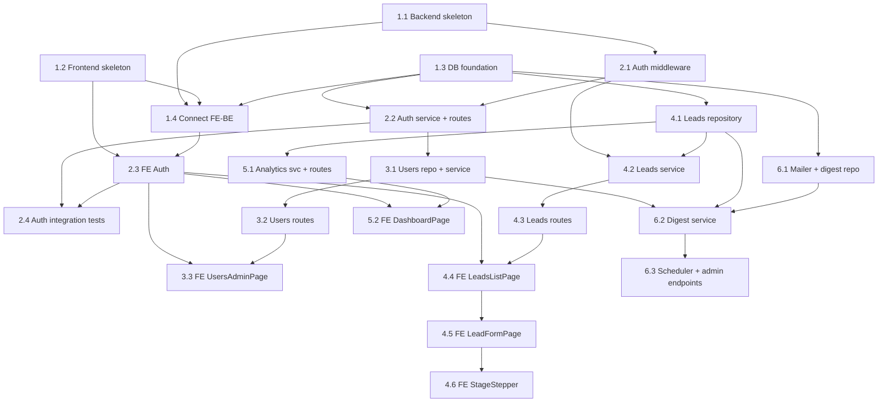

# Mvp-crm — Implementation Plan

**Project**: Mvp-crm | **Version**: 1.0 | **Created**: 2026-05-19
**Author**: AIRE_PRODUCT_OWNER | **Status**: APPROVED
**Team size**: 2 | **Tracking**: GitHub Projects #9 | **Build cycles**: none

> **Lean index.** Full per-story content lives in `docs/plans/stories/epic-N-story-N.M-*.md`. Dependency contract lives in `docs/plans/dependency-graph.yml` — **if this file drifts from the YAML, the YAML wins.** Run `aire graph-check` to verify.

---

## 1. Overview

**Success Criteria**: SC-1 through SC-10 — see `docs/requirements.md`.

**Epic Breakdown**:
- **Epic 1: Project Foundation** — Walking skeleton: backend + frontend + DB wired together.
- **Epic 2: Authentication** — JWT login, protected routes, FE auth context.
- **Epic 3: User Management** — Admin creates/deactivates Salesperson accounts.
- **Epic 4: Lead Management** — Role-scoped CRUD + stage transitions across BE and FE.
- **Epic 5: Analytics Dashboard** — 2 Recharts bar charts, role-scoped.
- **Epic 6: Weekly Email Digest** — Monday 09:00 cron + manual trigger + history.

---

## Dependency Graph

### Wave summary

| Wave | Stories | Parallelizable? |
|------|---------|-----------------|
| 1 | 1.1, 1.2, 1.3 | Yes — disjoint modulo `shared_files` |
| 2 | 1.4, 2.1, 4.1, 6.1 | Yes |
| 3 | 2.2, 4.2, 5.1 | Yes |
| 4 | 2.3, 3.1, 4.3 | Yes |
| 5 | 2.4, 3.2, 4.4, 5.2, 6.2 | Yes |
| 6 | 3.3, 4.5, 6.3 | Yes |
| 7 | 4.6 | n/a (single story) |

**Per-dev queues** (see `docs/plans/dependency-graph.yml` `assignments:`):
- **abhigyan.ranjan@3pillarglobal.com (12)**: 1.1 → 1.3 → 1.4 → 2.1 → 2.2 → 4.1 → 3.1 → 4.3 → 3.2 → 6.1 → 6.2 → 6.3
- **gourav.g@3pillarglobal.com (10)**: 1.2 → 2.3 → 4.2 → 5.1 → 2.4 → 4.4 → 5.2 → 3.3 → 4.5 → 4.6

Run `aire next-parallel --by-dev` after each merge to see what each dev can pick up next.

---

## EPIC 1: PROJECT FOUNDATION (Walking Skeleton)

**Owner**: DEV | **Goal**: Backend + frontend + DB wired together. Home page renders backend + DB connection status.
**Prerequisites**: docs/requirements.md, architecture, patterns. | **Completion**: `npm run dev` boots both processes; home page shows green status.

- **1.1** Backend skeleton — Express app factory, env loader, pino logger, errorHandler + requestId middleware, AppError hierarchy, `/api/health` route, central `routes.ts`. → `docs/plans/stories/epic-1-story-1.1-backend-skeleton.md`
- **1.2** Frontend skeleton — Vite + React + Tailwind + Router + TanStack QueryClient + `/api` client + AppShell. → `docs/plans/stories/epic-1-story-1.2-frontend-skeleton.md`
- **1.3** DB foundation — better-sqlite3 client (WAL pragmas), `migrate.ts` runner, `0001_init.sql` (users, leads, digest_runs + indexes + CHECK constraints), `seed.ts` for initial Admin. → `docs/plans/stories/epic-1-story-1.3-db-foundation.md`
- **1.4** Connect FE to BE — backend boots, runs migrations on start; frontend home page hits `/api/health` and shows backend + DB status. → `docs/plans/stories/epic-1-story-1.4-connect-fe-be.md`

---

## EPIC 2: AUTHENTICATION

**Owner**: DEV | **Goal**: Seeded Admin can log in; JWT-protected routes work; FE redirects unauthenticated users.
**Prerequisites**: Epic 1. | **Completion**: Login flow works end-to-end; integration tests pass.

- **2.1** Auth middleware — `authMiddleware`, `requireRole`, rate limiter on `/auth/login`, `req.user` augmentation. → `docs/plans/stories/epic-2-story-2.1-auth-middleware.md`
- **2.2** Auth service + routes — bcrypt verify, `POST /auth/login`, `GET /auth/me`, Zod `LoginSchema`. → `docs/plans/stories/epic-2-story-2.2-auth-service-routes.md`
- **2.3** Frontend Auth — `AuthProvider`, `useAuth`, `LoginPage`, `RequireAuth`, `RequireRole`, 401 interceptor. → `docs/plans/stories/epic-2-story-2.3-frontend-auth.md`
- **2.4** Auth integration tests — Supertest happy + 401 + rate-limit paths; FE MSW login smoke test. → `docs/plans/stories/epic-2-story-2.4-auth-integration-tests.md`

---

## EPIC 3: USER MANAGEMENT (Admin only)

**Owner**: DEV | **Goal**: Admin can create and deactivate Salesperson accounts.
**Prerequisites**: Epic 2. | **Completion**: Admin creates a user; user logs in; Admin deactivates; deactivated user → 401.

- **3.1** Users repository + service — list, create (bcrypt cost=12), patch; `ConflictError` on duplicate email. → `docs/plans/stories/epic-3-story-3.1-users-repository-service.md`
- **3.2** Users routes — `GET/POST/PATCH /users` behind `requireRole('admin')`; Zod schemas. → `docs/plans/stories/epic-3-story-3.2-users-routes.md`
- **3.3** Frontend UsersAdminPage — table, create-user modal, deactivate action, toast feedback. → `docs/plans/stories/epic-3-story-3.3-frontend-users-admin-page.md`

---

## EPIC 4: LEAD MANAGEMENT

**Owner**: DEV | **Goal**: Salespersons create/edit/progress their own leads; Admin sees all.
**Prerequisites**: Epic 2. | **Completion**: End-to-end lead lifecycle; role isolation verified by integration tests.

- **4.1** Leads repository — prepared statements for `listForUser` (role-scoped), `findById`, `insert`, `update`, `delete`, `updateStage`; `rowToLead` mapper. → `docs/plans/stories/epic-4-story-4.1-leads-repository.md`
- **4.2** Leads service — role-scope enforcement, stage validation, 404 on cross-rep access. → `docs/plans/stories/epic-4-story-4.2-leads-service.md`
- **4.3** Leads routes — `GET/POST/PATCH/DELETE /leads`, `POST /leads/:id/stage`, Zod schemas, integration tests. → `docs/plans/stories/epic-4-story-4.3-leads-routes.md`
- **4.4** Frontend LeadsListPage — TanStack Query, stage filter, debounced search, empty state, role-aware columns. → `docs/plans/stories/epic-4-story-4.4-frontend-leads-list-page.md`
- **4.5** Frontend LeadFormPage — create + edit with RHF + Zod, validation messages, invalidate on save. → `docs/plans/stories/epic-4-story-4.5-frontend-lead-form-page.md`
- **4.6** Frontend stage transition UI — `LeadDetailPage` + `StageStepper` + `useUpdateStage` mutation. → `docs/plans/stories/epic-4-story-4.6-frontend-stage-transition.md`

---

## EPIC 5: ANALYTICS DASHBOARD

**Owner**: DEV | **Goal**: 2 bar charts on `/dashboard`, role-scoped.
**Prerequisites**: Epic 4 (leads exist). | **Completion**: Charts render live, role-scoped, with empty state.

- **5.1** Analytics service + routes — `GET /analytics/leads-per-person`, `GET /analytics/leads-by-stage`; role-scoped at service layer. → `docs/plans/stories/epic-5-story-5.1-analytics-service-routes.md`
- **5.2** Frontend DashboardPage — 2 Recharts bar charts, lazy-loaded route, empty state. → `docs/plans/stories/epic-5-story-5.2-frontend-dashboard-page.md`

---

## EPIC 6: WEEKLY EMAIL DIGEST

**Owner**: DEV | **Goal**: Monday 09:00 server-local cron job sends digest to active Salespersons; Admin can trigger manually.
**Prerequisites**: Epic 3 + Epic 4. | **Completion**: Manual trigger sends emails via SMTP (Mailtrap); `digest_runs` row created.

- **6.1** Mailer + digest repository — nodemailer transporter factory + `digestRepository` over `digest_runs`; fake mailer for tests. → `docs/plans/stories/epic-6-story-6.1-mailer-digest-repository.md`
- **6.2** Digest service — `runWeeklyDigest({triggeredBy})`, per-recipient try/catch, write `digest_runs`. → `docs/plans/stories/epic-6-story-6.2-digest-service.md`
- **6.3** Scheduler + admin endpoints + CLI — `node-cron` in `server.ts` boot, `POST /admin/digest/run`, `GET /admin/digest/runs`, `npm run digest:run`. → `docs/plans/stories/epic-6-story-6.3-scheduler-admin-endpoints.md`

---

## Quality Gates

**Per Story**: Patterns followed; Vitest passes; ESLint 0 errors; AC met; coverage ≥85% on changed files; self-review section in story complete.
**Per Epic**: All stories Done; manual test group passes (see QA section); architecture invariants preserved (no SQL in services, no business logic in routes, role-scope tests green).
**Final**: All 6 epics Done; combined coverage ≥85%; 0 P0/P1 open; SC-1 through SC-10 demonstrably met.

---

## Risks

| Risk | Impact | Mitigation |
|------|--------|------------|
| Role-isolation bug leaks leads (FC-1) | High | Two-user fixtures in 2.4, 4.3, 4.4 integration tests; service applies scope, not route |
| Cron misfires if dev machine sleeps | Med | Manual trigger endpoint covers it (6.3); documented in README |
| SQLite write contention under load | Low | WAL mode set in 1.3; `synchronous=NORMAL` |
| JWT secret leak via commit | High | `.env.example` only; `.env` in `.gitignore`; ≥32-char validation in env loader |
| Chart library bundle bloat slows initial load | Low | Recharts is tree-shakeable; lazy-load the dashboard route (5.2) |
| 4-week timeline slips on scope creep | Med | Strict OUT list in requirements; no new epics added without explicit user approval |

---

## QA Manual Testing Groups

Groups are ordered by first testable milestone, by epic. Every story appears in exactly one group; backend stories are listed as prerequisites (marked `[backend]`) inside the group that makes them manually testable.

### Epic 1: Project Foundation

**Group 1** — Stories: 1.1 `[backend]`, 1.2, 1.3 `[backend]`, 1.4
Once all stories in this group are done, QA can verify that `npm install && npm run seed && npm run dev` boots both backend (port 4000) and frontend (port 5173) without errors, the home page at `http://localhost:5173/` renders an "MVP-CRM" shell, and the health-status panel reads "Backend: Connected" and "Database: Connected". Story 1.1 provides the API and error-envelope skeleton; 1.3 provides the SQLite file + initial schema + seeded Admin; 1.2 provides the React shell + API client; 1.4 wires the home page to call `/api/health` and renders the two statuses. Verify also that stopping the backend → the panel turns red ("Backend: Disconnected").

### Epic 2: Authentication

**Group 1** — Stories: 2.1 `[backend]`, 2.2 `[backend]`, 2.3, 2.4
QA can perform end-to-end login: navigate to `/login`, submit the seeded Admin credentials → JWT issued, redirected to `/leads` (or home), `Authorization: Bearer` header attached to subsequent calls. Wrong password → inline error, no user enumeration. 6 rapid failed attempts → 429 from rate limiter. Direct navigation to `/leads` without a token redirects to `/login`. Refresh keeps the session (JWT in localStorage). Token expiry / 401 from any API call boots back to `/login`. 2.4 supplies the regression net (auth/integration tests) — confirm Vitest is green.

### Epic 3: User Management

**Group 1** — Stories: 3.1 `[backend]`, 3.2 `[backend]`, 3.3
Admin navigates to `/users` (Salesperson should see 403/forbidden UI). Admin sees all users with email, name, role, active flag. Admin creates "alice@example.com" with role Salesperson and a 12-char password → Alice appears in the list. Logout, log in as Alice → success. Logout, log in as Admin again → deactivate Alice. Alice's next login → 401 (Inactive). Email uniqueness: re-creating "alice@example.com" → 409 with toast. 3.1 + 3.2 supply the API + role gate; 3.3 supplies the table, create modal, and deactivate action.

### Epic 4: Lead Management

**Group 1** — Stories: 4.1 `[backend]`, 4.2 `[backend]`, 4.3 `[backend]`, 4.4, 4.5, 4.6
Full end-to-end lead lifecycle. As Alice (Salesperson), navigate to `/leads` → empty state. Click "New Lead" → fill opportunity name, contact person, est. closing date (future), lead value (≥0), optional notes → save. Lead appears in the list with stage "Evaluating". Open detail → move stage via stepper to "Proposing" → list updates. Filter by stage → only matching shown. Search by opportunity name (case-insensitive substring) → matches. Create a second user Bob and a second lead as Bob: Alice cannot see Bob's lead in the list or via direct URL `/leads/<bob-id>` (404). Admin sees both leads with an owner column. Validation: empty required field, negative lead value, past closing date → form errors. 4.1/4.2/4.3 supply the BE (repository, role-scoped service, routes + stage transition); 4.4 the list page; 4.5 the form; 4.6 the detail/stepper.

### Epic 5: Analytics Dashboard

**Group 1** — Stories: 5.1 `[backend]`, 5.2
As Admin on `/dashboard`: "Total leads per person" bar chart shows one bar per Salesperson with their lead count; "Lead distribution by stage" shows 4 bars (Evaluating, Proposing, Solutioning, Complete) with live counts. As Alice (Salesperson): leads-per-person chart shows only her bar; leads-by-stage shows only her own breakdown. Empty state when no leads exist. Bars update after creating / moving a lead in `/leads` then revisiting `/dashboard` (no caching).

### Epic 6: Weekly Email Digest

**Group 1** — Stories: 6.1 `[backend]`, 6.2 `[backend]`, 6.3
Configure Mailtrap (or any test SMTP) in `.env`. Run `npm run digest:run` (CLI) or `POST /api/admin/digest/run` as Admin → response shows `recipients`, `successes`, `failures` counts. Mailtrap inbox shows one email per active Salesperson who has ≥1 non-Complete lead. Email subject matches `Your active leads — week of YYYY-MM-DD`. Email body lists opportunity name, stage, est. closing date, lead value, last-updated for each active lead. `GET /api/admin/digest/runs` returns the last 30 runs including this one. Force a bad SMTP password for one recipient → that recipient's failure recorded in `digest_runs.notes`; other recipients still receive their emails. 6.1 supplies the mailer transporter + repo; 6.2 supplies the orchestration logic; 6.3 wires the cron + admin endpoints + CLI.

---

## CRITICAL RULES

Every story MUST include:
1. Must Read References (top — `SPEC/references/`, requirements.md, architecture, patterns)
2. Epic Context (Epic #, Story ID, Date, Jira/GitHub)
3. **Requires / Enables / Files Touched / Assignee** mirroring `docs/plans/dependency-graph.yml`
4. Story Description (detailed)
5. Acceptance Criteria (comprehensive)
6. Prerequisites
7. Context Files (paths)
8. Patterns (with doc links → `docs/architecture/design/01-patterns-and-standards-greenfield.md`)
9. Implementation Steps (numbered, code with patterns applied)
10. Tests (Vitest unit + integration with code + manual)
11. Quality Checks (ESLint, coverage ≥85%)
12. Explicitly OUT of Scope
13. Completion Evidence (test output, screenshots)

**DO NOT** include Duration, Timeline, or Estimate fields in stories.
